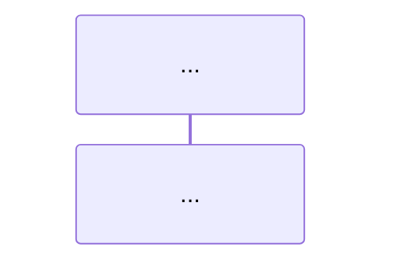

# Subagent Task Assignments - VSCode Copilot Documentation Project

## Context

We are creating two final documents based on research in `docs/copilot_chat_research*.md` and `docs/copilot_chat_annex*.md`:

1. **vscode_copilot_workflow_final.md** - Complete description of VSCode Copilot Chat workflow
2. **oai_service_implementation_plan.md** - Implementation plan for fixing our OAI service

## Source Materials

- `/home/niku/Sandbox/outlier_wormhole/docs/copilot_chat_research1.md`
- `/home/niku/Sandbox/outlier_wormhole/docs/copilot_chat_research2.md`
- `/home/niku/Sandbox/outlier_wormhole/docs/copilot_chat_research3.md`
- `/home/niku/Sandbox/outlier_wormhole/docs/copilot_chat_annex.md`
- `/home/niku/Sandbox/outlier_wormhole/docs/copilot_chat_annex1.md`
- `/home/niku/Sandbox/outlier_wormhole/services/oai/` (current implementation)

---

## TASK 2: Extract and Document Prompt Building Workflow

**Assignee**: Subagent 1
**Target File**: `docs/vscode_copilot_workflow_final.md` (Section 1)
**Source**: Research docs, especially research1.md and research2.md

### Instructions:

Read the research documents and extract:

1. How `PromptRenderer` works
2. How system messages are created and collapsed
3. How user messages are constructed
4. How context, attachments, and tool references are included
5. The order of message assembly

Create a clear step-by-step description with:

- Bullet points for each step
- Code references (file paths and function names)
- Example JSON showing the structure of messages array
- Example of a complete prompt request body

Write directly to Section 1 in `vscode_copilot_workflow_final.md`.

---

## TASK 3: Extract and Document Tools Registration and Exposure

**Assignee**: Subagent 2
**Target File**: `docs/vscode_copilot_workflow_final.md` (Section 2)
**Source**: All research docs, focus on tool-related sections

### Instructions:

Extract and document:

1. How `ICopilotTool` is defined
2. Tool registry and `getAgentTools` function
3. Tool schema format (name, description, inputSchema/parameters)
4. How tools are added to request body (functions/tools field)
5. Difference between OpenAI functions vs Copilot tools format

Provide:

- Clear explanation of tool definition structure
- Example tool schema JSON (use examples from research)
- Example of how tools appear in request body
- Code file references

Write directly to Section 2 in `vscode_copilot_workflow_final.md`.

---

## TASK 4: Extract and Document SSE Streaming Behavior

**Assignee**: Subagent 3
**Target File**: `docs/vscode_copilot_workflow_final.md` (Section 3)
**Source**: Research2.md, Research3.md, Annex files

### Instructions:

Document the SSE streaming mechanics:

1. SSE event types (message_start, content_block_delta, etc.)
2. `IResponseDelta` structure and fields
3. How `beginToolCalls` is detected
4. How `copilotToolCalls` deltas are accumulated
5. Parser behavior for partial JSON arguments

Provide:

- Step-by-step flow of SSE events
- Example SSE event sequence (from annexes)
- `IResponseDelta` JSON structure
- Code references to SSEProcessor and stream.ts

Write directly to Section 3 in `vscode_copilot_workflow_final.md`.

---

## TASK 5: Extract and Document Tool Invocation Flow

**Assignee**: Subagent 4
**Target File**: `docs/vscode_copilot_workflow_final.md` (Section 4)
**Source**: Research1.md, Research2.md, focus on ToolCallingLoop

### Instructions:

Document the complete tool invocation cycle:

1. How `ToolCallingLoop` collects tool calls from deltas
2. Validation with AJV and `validateToolInput`
3. Tool invocation via `ToolsService.invokeTool`
4. `LanguageModelToolResult` structure
5. How tool results are injected back into conversation
6. Loop termination conditions

Provide:

- Step-by-step invocation flow
- Example tool call object
- Example tool result object
- Code references to ToolCallingLoop and ToolsService

Write directly to Section 4 in `vscode_copilot_workflow_final.md`.

---

## TASK 6: Compile Complete Workflow Example with JSON

**Assignee**: Subagent 5
**Target File**: `docs/vscode_copilot_workflow_final.md` (Section 5)
**Source**: Annex files have concrete examples

### Instructions:

Create a complete end-to-end example showing:

1. Initial request with tools (full JSON)
2. SSE response with text + tool call (sequence of events)
3. Tool invocation (input and result)
4. Follow-up request with tool result (full JSON)
5. Final response (SSE events)

Use the examples from the annex files. Make sure the example is:

- Complete and realistic
- Shows actual JSON structures
- Includes all SSE events in sequence
- Shows the tool message injection clearly

Write directly to Section 5 in `vscode_copilot_workflow_final.md`.

---

## TASK 7: Create Mermaid Sequence Diagram

**Assignee**: Subagent 6
**Target File**: `docs/vscode_copilot_workflow_final.md` (Section 6)
**Source**: Annex1.md has a mermaid diagram to expand

### Instructions:

Create or improve the mermaid sequence diagram to show:

- User input → Prompt building
- Request construction → LM endpoint
- SSE streaming → Parser → Deltas
- Tool call detection → ToolsService
- Tool execution → Result collection
- Result injection → New request
- Final response

The diagram should be comprehensive but readable. Include:

Write directly to Section 6 in `vscode_copilot_workflow_final.md`.

---

## TASK 9: Analyze Current OAI Service Architecture

**Assignee**: Subagent 7
**Target File**: `docs/oai_service_implementation_plan.md` (Section 2)
**Source**: `/home/niku/Sandbox/outlier_wormhole/services/oai/`

### Instructions:

Analyze the current OAI service:

1. Read wormhole-oai.py, agent_workflow.py, template_composer.py
2. Document current request handling flow
3. Document how tool calls are currently parsed and generated
4. Document how prompts are currently assembled
5. Identify what works and what doesn't

Provide:

- Architecture diagram (text or mermaid)
- Current flow description
- Current prompt handling
- Current tool call handling

Write directly to Section 2 in `oai_service_implementation_plan.md`.

---

## TASK 10: Design Prompt Injection Strategy

**Assignee**: Subagent 8
**Target File**: `docs/oai_service_implementation_plan.md` (Section 4)
**Source**: VSCode workflow doc + current OAI service

### Instructions:

Design how to inject system prompt into user prompt:

1. Where to insert system content in user message
2. How to preserve structure expected by Outlier
3. How to maintain context/attachments
4. Format that won't confuse the agent

Provide:

- Clear injection strategy
- Before/after examples
- Code location for changes
- Potential issues and solutions

Write directly to Section 4 in `oai_service_implementation_plan.md`.

---

## TASK 11: Design Tool Calling Response Format

**Assignee**: Subagent 9
**Target File**: `docs/oai_service_implementation_plan.md` (Section 5)
**Source**: VSCode workflow doc section 3

### Instructions:

Design proper SSE streaming response format:

1. Correct SSE event sequence for tool calls
2. `beginToolCalls` delta structure
3. `copilotToolCalls` delta structure with proper fields
4. Finish reason handling
5. Streaming vs non-streaming responses

Provide:

- Expected SSE event sequence
- Example JSON for each delta type
- Code changes needed in wormhole-oai.py
- Comparison with current implementation

Write directly to Section 5 in `oai_service_implementation_plan.md`.

---

## TASK 12: Design Tool Result Handling

**Assignee**: Subagent 10
**Target File**: `docs/oai_service_implementation_plan.md` (Section 6)
**Source**: VSCode workflow doc section 4

### Instructions:

Design how to handle tool results from VSCode:

1. How to detect tool result messages in incoming request
2. How to format tool results for Outlier platform
3. How to maintain conversation context
4. Loop continuation logic

Provide:

- Tool result detection logic
- Format conversion examples
- Code changes in agent_workflow.py
- Edge cases to handle

Write directly to Section 6 in `oai_service_implementation_plan.md`.

---

## TASK 13: Create Step-by-Step Implementation Checklist

**Assignee**: Subagent 11
**Target File**: `docs/oai_service_implementation_plan.md` (Section 7)
**Source**: Sections 4, 5, 6 from the plan

### Instructions:

Create detailed implementation steps:

1. List all files to modify
2. For each file, list specific changes
3. Order steps by dependency
4. Include testing points after each major change
5. Include rollback strategies

Provide:

- Numbered step-by-step checklist
- File-by-file change description
- Function-level detail where needed
- Testing checkpoints

Write directly to Section 7 in `oai_service_implementation_plan.md`.

---

## Important Notes for All Subagents:

1. **Read source materials carefully** - All information is in the research docs
2. **Be specific** - Include code file paths, function names, JSON examples
3. **Be clear** - Write for someone who hasn't read the research
4. **Use examples** - Copy/adapt examples from the research docs
5. **Cross-reference** - Mention related sections when relevant
6. **Write directly to target files** - Don't create separate files

## Coordination:

- Tasks 2-7 build the VSCode workflow document
- Tasks 9-13 build the implementation plan
- Some tasks depend on others (e.g., Task 13 needs 10-12 first)
- Manager will coordinate task execution order
