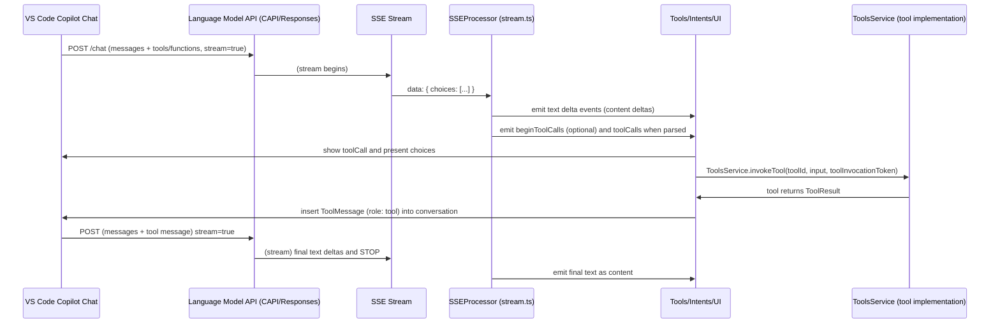

# Copilot Chat Annex — End-to-end Example, Mermaid Flow, and JSON Samples

This annex contains an end-to-end trace for a Copilot Chat agent session with tool calling, a mermaid diagram describing the message flow, and sanitized JSON examples for the requests, SSE chunks, tool invocation, and final response.

Use this for developer-level understanding, tests, or mock servers.

## Contents

- Scenario & context
- Example trace (step-by-step with timings)
- Raw SSE chunk trace (sanitized)
- Tool invocation: extension behavior & tool result message
- Example final request including tool result and final response
- Mermaid flow diagram
- Notes & edge cases

---

## Scenario & Context

Example scenario: A user asks the Copilot Chat agent to find a short explanation for how SSE streaming parsers handle partial deltas. The agent is enabled to call a search tool (named `search`) registered with the extension.

The system: VS Code Copilot Chat extension calls the LM endpoint with `messages`, `functions` and `tools` fields, and `stream: true`. The model emits text and a `tool_calls` or `function_call` to request a tool invocation. The extension buffers the tool call, invokes the tool (via `ToolsService.invokeTool`), receives a tool result, inserts a `ToolMessage` into the conversation with `role: tool`, and sends a follow-up request. The model then returns the final answer.

## Example Trace (Step-by-step)

1. Client (VS Code extension) builds the prompt and request body:
   - System message: assistant identity + safety rules.
   - User message: "Explain briefly how SSE streaming parsers handle partial deltas".
   - Tools: `search` tool registered in `tools` and `functions` if needed.
   - stream: true.

2. Client makes an HTTP POST request to the LM endpoint with headers:
   - Authorization: Bearer <token>
   - X-Request-Id: <uuid>
   - X-Interaction-Type: `agent` (optional)
   - OpenAI-Intent: `chat` (optional)

3. Server starts streaming SSE data in `data:` lines.
   - The SSE parser emits text `content` deltas as they arrive.
   - Parser detects `beginToolCalls` (when model indicates it will call a tool) and `tool_calls` deltas that contain id, function name, and arguments (these may arrive chunked).

4. Model emits tool call: it streams `beginToolCalls` marker, followed by `tool_calls` delta: tool id: `call1`, tool name: `search`, arguments: `{"query":"SSE streaming parser"}`. The stream finish reason indicates `tool_calls` for that choice.

5. SSE parser buffers the tool_call, assembles the final `ICopilotToolCall` object and emits it to the UI / intents loop.

6. The UI or the intent code triggers `ToolsService.invokeTool('search', {query: 'SSE streaming parser'}, ...)`. The tool implementation runs and fetches search results.

7. The tool returns a result (e.g., JSON of search results). The extension inserts a `ToolMessage` into the conversation (role `tool`) with `name: 'search'`, `content` (JSON string), and `toolCallId: 'call1'`.

8. The client sends a new request to LM backend (a follow-up) containing the previous messages _plus_ the new `ToolMessage`.

9. The model consumes the tool result and returns a final content response (a human-readable answer) as a streaming SSE or a final completion.

10. The SSE parser mirrors final text deltas to the UI and the conversation shows the model’s final answer.

## Sanitized SSE chunk trace

Below is an example of an SSE stream (sanitized and simplified). In practice, chunks may contain many other fields like `logprobs`, `copilot_annotations`, etc.

Note: Each `data:` line corresponds to a data chunk from the SSE stream. The JSON object is typical for the Copilot proxy which extends `choice.delta` with `function_call` and `tool_calls`.

1. Partial text

data: {"choices":[{"delta":{"content":"Sure — I can look this up and summarize."},"index":0}]}

2. More text

data: {"choices":[{"delta":{"content":"I’m going to search the web for SSE streaming parser details..."},"index":0}]}

3. Begin tool calls (model signals it will call tools)

data: {"choices":[{"delta":{"beginToolCalls":{"toolCallIds":["call1"]}},"index":0}]}

4. Tool call delta (partial; arguments might be chunked across multiple deltas)

data: {"choices":[{"delta":{"tool_calls":[{"id":"call1","function":{"name":"search","arguments":"{\"query\": \"SSE streaming parser\""}}],"index":0}]}

5. Tool call delta continued (complete argument)

data: {"choices":[{"delta":{"tool_calls":[{"id":"call1","function":{"name":"search","arguments":"{\"query\": \"SSE streaming parser\"}"}}],"index":0}]}

6. Choice finish reason = tool calls

data: {"choices":[{"finish_reason":"tool_calls","index":0}]}

7. The SSE parser emits a `FinishedCompletion` with `reason: ToolCalls` and `toolCalls: [{id: 'call1', name: 'search', arguments: '{"query":"SSE streaming parser"}'}]`.

## Tool invocation & tool result (sanitized)

- Extension receives the tool call: `ICopilotToolCall{name:"search",arguments:"{\"query\":\"SSE streaming parser\"}", id:"call1"}`.

- Extension runs the registered `search` tool. The `resolveInput` hook might examine the tool input; `ToolsService.invokeTool` runs the tool with the parsed JSON.

- The registered `search` tool returns a `ToolResult` object. Here’s a sanitized example:

Tool result payload (extension -> conversation as `tool` message):

{
"role": "tool",
"name": "search",
"content": "{\"results\":[{\"title\":\"SSE parsing guide\",\"snippet\":\"Server-sent events (SSE) can stream data; partial JSON arrays may be chunked into multiple messages...\"}]}",
"toolCallId": "call1"
}

## Example final follow-up request (client -> LM) including tool result

Request body (sanitized):

{
"model": "copilot-chat-xxx",
"messages": [
{"role":"system","content":"You are Copilot Chat "},
{"role":"user","content":"Explain briefly how SSE streaming parsers handle partial deltas"},
{"role":"assistant","content":"I found some search results."},
{"role":"tool","name":"search","content":"{\"results\":[...]}" ,"toolCallId":"call1"}
],
"stream": true,
"tools": [
{"toolId":"search","function":{"name":"search","description":"Search the web for info","parameters":{"type":"object","properties":{"query":{"type":"string"}},"required":["query"]}},"type":"function"}
]
}

Note: The `tools` object can either be a standard OpenAI `functions[]` style or a Copilot-specific `tools`/`OpenAiResponsesFunctionTool` depending on the endpoint.

## Example final streaming response from LM

1. Stream initiates

data: {"choices":[{"delta":{"content":"SSE streaming parsers handle partial deltas by reading chunks as they arrive, buffering incomplete JSON fragments, and assembling them into a whole message."},"index":0}]}

2. final chunk and done

data: {"choices":[{"finish_reason":"stop","index":0}]}

data: [DONE]

## Mermaid Flow Diagram

Below is a Mermaid flow diagram (copyable and viewable if your tool supports Mermaid):

## Notes & Edge Cases

- Function calls vs tool calls: Extension supports both OpenAI style `function_call` and Copilot-specific `tool_calls`; the SSE parser handles both.
- Partial JSON arguments: The `function_call.arguments` or `tool_calls[*].function.arguments` JSON strings may be split across multiple chunks. The parser buffers and only emits events when the call is complete.
- `toolInvocationToken`: Tool calls can include `toolInvocationToken` metadata to pass a session token to the tool. The tool must handle and validate it.
- Multiple choices: The SSE stream supports multiple choices; the parser uses `expectedNumChoices` to track multiple streams and only emits usage fields.
- Error handling: If the SSE stream returns a `finish_reason` of `function_call` or `tool_calls`, the extension will expect a call; other `finish_reason` values indicate stop, length, or content filter cancellation.

---

If you'd like, I can now:

- Add a small unit test that simulates the SSE stream trace and asserts the parser yields `toolCalls` and `text` parts in the correct order.
- Produce a redacted recorded SSE log file that demonstrates the exact sequence.
- Expand the mermaid diagram into a more detailed swim-lane diagram.

Which one would you prefer next?
