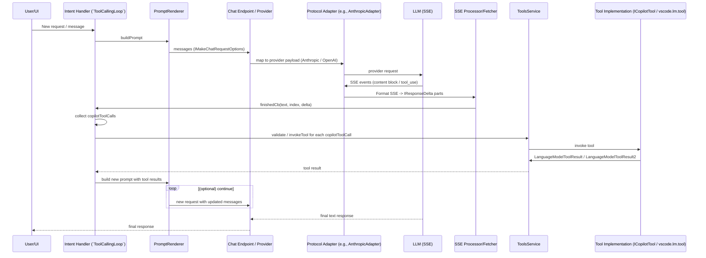

# Copilot Chat Annex 1 — End-to-End Trace, Mermaid Diagram & JSON Examples

This annex provides a single concrete end-to-end example tying the pieces together for how Copilot Chat agents handle streaming LLM responses, detect and perform tool calls, and iterate.

Contents:

- End-to-end trace with code references
- Mermaid diagram of the flow
- Concrete JSON request & response examples (Anthropic-style request, SSE events, and IResponseDelta chunks)
- Tool invocation JSON & return value example

---

## 1) End-to-end trace (concrete annotated flow)

The following trace ties the code paths together for a single iteration where the model streams text and then triggers two tool calls (an `edit_file` tool run on two different files). The example is based on test snapshots and adapters in this repository.

1. User/IDE: A request originates (e.g., user asks: "Make these changes for me"). The chat UI constructs a `ChatRequest` and asks the intent handler to run.
   - Code: Intents registered under `src/extension/intents/node/*`
   - Example request object is of `vscode.ChatRequest` (the `ToolCallingLoop` reads `this.options.request`).

2. Build Prompt: `ToolCallingLoop.runOne` calls the prompt builder; `PromptRenderer` composes the final `Raw.ChatMessage[]` (system + user + history + tool results from previous rounds).
   - Code: `src/extension/prompts/node/base/promptRenderer.ts` and `RendererIntentInvocation`.
   - `buildPromptResult.messages` is passed to the fetch request.

3. Make the LLM request: The `ToolCallingLoop.fetch` call builds `IMakeChatRequestOptions` and calls `IChatEndpoint.makeChatRequest2` or a similar `fetch` path.
   - Code: `src/extension/intents/node/toolCallingLoop.ts`(calls `this.fetch` -> endpoint provider) and `src/platform/endpoint/node/chatEndpoint.ts`.
   - Example `IMakeChatRequestOptions` includes `messages`, `requestOptions.tools` (as function tools), and `finishedCb` (callback to receive deltas).

4. Local Server / Adapter: For the local `languageModelServer` usage or BYOK endpoint, a protocol adapter (like `AnthropicAdapter`) maps `Raw` messages to a provider's request signature.
   - Code: `src/extension/agents/node/langModelServer.ts` and `src/extension/agents/node/adapters/anthropicAdapter.ts`.

5. Provider & SSE: The provider (Anthropic/OpenAI/CAPI) streams SSE events. The adapter converts internal stream blocks to provider SSE; conversely, the endpoint `sseProcessor` parses SSE events and emits response `IResponseDelta` objects.
   - Code: `src/extension/agents/node/adapters/anthropicAdapter.ts`, `src/platform/endpoint/node/stream.ts`, and `src/platform/chat/common/chatMLFetcher.ts`.
   - Example SSE events: `content_block_start`, `content_block_delta`, `content_block_stop`, `message_delta` with `stop_reason` (e.g. `tool_use`), `message_stop`.

6. Stream deltas -> `finishedCb`: Each parsed SSE event is converted into `IResponseDelta` chunks and passed to the `finishedCb` callback provided by the `ToolCallingLoop.fetch` call. The `finishedCb` receives `(text, index, delta)` where `delta` can contain `beginToolCalls` and `copilotToolCalls`.
   - Code: `done` callback code in `ToolCallingLoop.runOne`.
   - This is also the place where `statefulMarker`, `thinking` deltas, etc., are captured.

7. Collect tool calls: `ToolCallingLoop` appends any `delta.copilotToolCalls` to its `toolCalls` array. Typically `beginToolCalls` signals that tool-calls will be coming next.
   - Code: `src/extension/intents/node/toolCallingLoop.ts` & the `finishedCb` handler.

8. Finalization: When the provider prints `message_delta` with `stop_reason: 'tool_use'`, the agent recognizes the model asked to call tools and stops streaming until tool results are injected.
   - Code: `AnthropicAdapter` sets stop_reason when `hadToolCalls` is true.

9. Validation & tool invocation: For each collected `IToolCall`, the agent validates the `arguments` JSON against the tool's `inputSchema` using AJV (`validateToolInput`). If valid, the agent calls `ToolsService.invokeTool`, which delegates to `vscode.lm.invokeTool(getContributedToolName(name))` or the extension-owned `ICopilotTool`.
   - Code: `src/extension/tools/common/toolsService.ts` (validate) & `src/extension/tools/vscode-node/toolsService.ts` (invoke).

10. Tool result: The executed tool returns `vscode.LanguageModelToolResult2` or `LanguageModelToolResult` containing `content` parts. `ToolCallingLoop` stores this in `this.toolCallResults` keyed by the `toolCallId` and appends another `ToolCallRound` containing the tool call and its result.
    - Code: `ToolCallRound.create()` & `toolCallResults: Record<string, LanguageModelToolResult2>` in `ToolCallingLoop`.

11. Injection & next prompt: The loop constructs a new prompt context including tool results (as `Raw.Tool` messages or as `toolCallResults` in `buildPromptContext`) and iterates, calling `fetch` again. The model now sees the tool results and can continue with additional text or additional tool calls.
    - Code: `ToolCallingLoop.run` loop and `createPromptContext` returns `toolCallResults` to the prompt renderer.

12. Loop termination: The loop stops when either no further `copilotToolCalls` are present or the `toolCallLimit` is reached and `ToolCallLimitBehavior` decides to stop or confirm.
    - Code: `ToolCallingLoop.run` and `ToolCallLimitBehavior` logic.

---

## 2) Mermaid diagram (high-level sequence)

Include the following mermaid diagram to visualize the end-to-end flow. Paste this raw mermaid block into the annex document or any mermaid renderer.



---

## 3) Concrete JSON examples

Below are concrete example JSONs derived from the test snapshots (`src/platform/endpoint/test/node/__snapshots__/stream.sseProcessor.spec.ts.snap`) and adapter code.

### 3.1 Example Anthropic request body (input to `AnthropicAdapter.parseRequest`)

```json
{
  "model": "claude-v1",
  "system": "You are a helpful AI assistant tasked with modifying files",
  "messages": [
    {
      "role": "assistant",
      "content": [{ "type": "text", "text": "Assistant intro..." }]
    },
    {
      "role": "user",
      "content": [
        {
          "type": "text",
          "text": "Add a multiply function and modify server to return dad jokes."
        }
      ]
    }
  ],
  "temperature": 0.0,
  "tools": [
    {
      "name": "edit_file",
      "description": "Edit a file in repo",
      "input_schema": {
        "type": "object",
        "properties": {
          "filePath": { "type": "string" },
          "code": { "type": "string" }
        },
        "required": ["filePath"]
      }
    }
  ]
}
```

Notes:

- `AnthropicAdapter.parseRequest` will convert `messages` + `system` into `Raw.ChatMessage[]` via `anthropicMessagesToRawMessages`.
- `options.tools` are added to `IMakeChatRequestOptions` to provide the function metadata for the model to emit `tool_use` events.

---

### 3.2 Example event stream (SSE) from the provider (conceptual / abbreviated)

This sequence demonstrates text streaming followed by tool calls (two `edit_file` calls). The adapter emits `content_block_start`, `content_block_delta`, `content_block_stop`, and `content_block_start` for `tool_use`.

(blanks added for readability)

```
data: {"type":"message_start","message":{"id":"REQUEST_ID","role":"assistant","model":"claude-v1","content":[],"usage":{...}}}

data: {"type":"content_block_start","index":0,"content_block":{"type":"text","text":""}}

data: {"type":"content_block_delta","index":0,"delta":{"type":"text_delta","text":"I'll make two changes:"}}

data: {"type":"content_block_delta","index":0,"delta":{"type":"text_delta","text":"\n1. Add a multiply function to test.js"}}

data: {"type":"content_block_stop","index":0}

data: {"type":"content_block_start","index":1,"content_block":{"type":"tool_use","id":"tooluse_448k6WHnTpS28K0Bd1bhgA","name":"edit_file","input":{}}}

data: {"type":"content_block_delta","index":1,"delta":{"type":"input_json_delta","partial_json":"{\"filePath\":\"/path/test.js\",\"code\":\"function multiply(a,b) { return a*b; }\"}"}}

data: {"type":"content_block_stop","index":1}

data: {"type":"content_block_start","index":2,"content_block":{"type":"tool_use","id":"tooluse_2SRF2HS...","name":"edit_file","input":{}}}

data: {"type":"content_block_delta","index":2,"delta":{"type":"input_json_delta","partial_json":"{\"filePath\":\"/path/server.js\",\"code\":\"...dad jokes...\"}"}}

data: {"type":"content_block_stop","index":2}

data: {"type":"message_delta","delta":{"stop_reason":"tool_use"},"usage":{...}}

data: {"type":"message_stop"}

```

This is processed by `SSE Processor` and `chatMLFetcher` to produce `IResponseDelta` chunks.

---

### 3.3 Example IResponseDelta deltas (finishedCallback chunks)

This style of delta is what arrives at the `finishedCb` invoked by `ToolCallingLoop`: chunks of `text` deltas, `beginToolCalls`, and `copilotToolCalls` elements.

```json
[
  {
    "text": "I'll make two changes:\n1. Add a multiply function to test.js\n2. Modify server.js to return a random dad joke from a small collection ",
    "index": 0,
    "delta": {
      "text": "... small collection "
    }
  },
  {
    "text": "I'll make two changes... ",
    "index": 0,
    "delta": {
      "text": "",
      "beginToolCalls": [{ "name": "edit_file" }]
    }
  },
  {
    "text": "",
    "index": 0,
    "delta": {
      "text": "",
      "copilotToolCalls": [
        {
          "name": "edit_file",
          "arguments": "{\"filePath\":\"/path/test.js\",\"code\":\"...\"}",
          "id": "tooluse_448k6WHnTpS28K0Bd1bhgA"
        },
        {
          "name": "edit_file",
          "arguments": "{\"filePath\":\"/path/server.js\",\"code\":\"...\"}",
          "id": "tooluse_2SRF2HShTXOoLdGrjWuGiw"
        }
      ]
    }
  }
]
```

Notes:

- `beginToolCalls` signals the model is transitioning to tool calls.
- `copilotToolCalls` provides an array of calls — each contains `name`, `arguments` (stringified JSON), and `id`.

---

### 3.4 Example `ToolsService.invokeTool` call (call site)

`ToolsService` executes:

```ts
// Example call in TS
this._onWillInvokeTool.fire({ toolName: name });
return vscode.lm.invokeTool(getContributedToolName(name), options, token);
```

Where `options` is `vscode.LanguageModelToolInvocationOptions<Object>` containing the parsed JSON input and possibly other fields.

Example options payload (illustrative):

```json
{
  "input": {
    "filePath": "/path/test.js",
    "code": "function multiply(a,b){ return a*b; }",
    "explanation": "Add multiply function"
  },
  "meta": { "author": "Copilot" }
}
```

We pass this `input` to the tool implementor. The tool returns a `LanguageModelToolResult` or `LanguageModelToolResult2`.

---

### 3.5 Example tool result (LanguageModelToolResult) representation

A tool result contains `content` (one or more parts). Example:

```json
{
  "content": [
    { "type": "text", "value": "Added multiply function to /path/test.js" }
  ]
}
```

When the `ToolCallingLoop` receives the tool result, it stores it in `this.toolCallResults[toolCallId] = result`, and it will be injected into the next prompt as `Raw.Tool` messages via `anthropicMessagesToRawMessages` mapping or direct injection in the prompt context.

---

## 4) Where to find these pieces in repo

- Prompt rendering & `RenderPromptResult`: `src/extension/prompts/node/base/promptRenderer.ts`
- SSE & local server implementation: `src/extension/agents/node/langModelServer.ts` and `src/extension/agents/node/adapters/*`
- IResponseDelta shape: `src/platform/networking/common/fetch.ts`
- Tool calling loop: `src/extension/intents/node/toolCallingLoop.ts` (main loop & `finishedCb` handling)
- Tools service: `src/extension/tools/common/toolsService.ts` (validate) & `src/extension/tools/vscode-node/toolsService.ts` (invoke)
- Tests showing SSE to `IResponseDelta` mapping: `src/platform/endpoint/test/node/__snapshots__/stream.sseProcessor.spec.ts.snap`

---

## 5) Quick Troubleshooting & Notes

- Partial JSON in tool arguments: the `finishedCb` can receive `toolCallDelta` increments; the `ToolCallingLoop` only acts on completed `copilotToolCalls` entries.
- Validation: If `validateToolInput` returns `IToolValidationError`, the agent logs and can append `ToolFailureEncountered` metadata. The loop may retry if a subsequent prompt reconstructs the arguments.
- Tool invocation limits and stop/confirm behavior are controlled by `ToolCallLimitBehavior` and handled inside `ToolCallingLoop.run`/`hitToolCallLimit()`.

---

## 6) Next steps & follow-ups

- If you want this annex used for documentation or external docs, we should add more diagrams including HTTP payload examples for each provider (OpenAI/Anthropic/Gemini) with exact endpoints and headers, and also list how `statefulMarker`s get carried into the next request (and where they are set in the request options).
- We can also add a small script that simulates an `IResponseDelta` stream and demonstrates the `ToolCallingLoop` invocation (small harness using the test mocks like `MockEndpoint`) if you want runnable examples.

---

(End of Annex 1)
