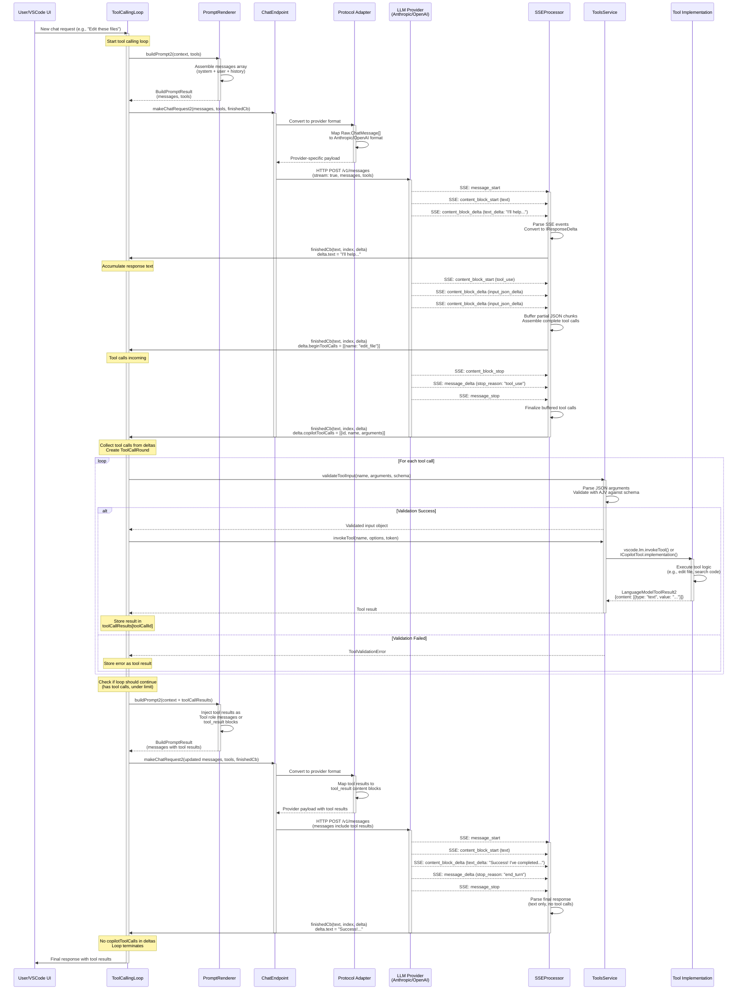
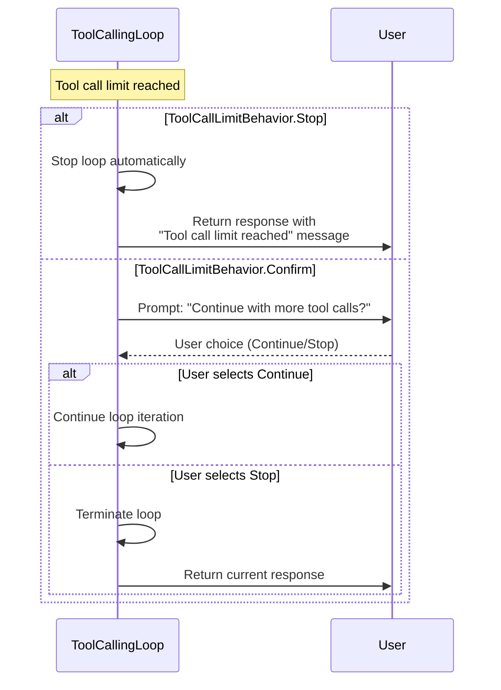
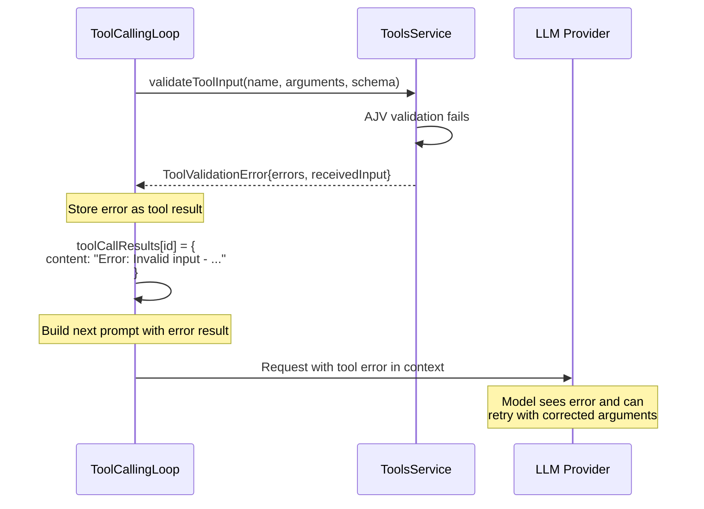
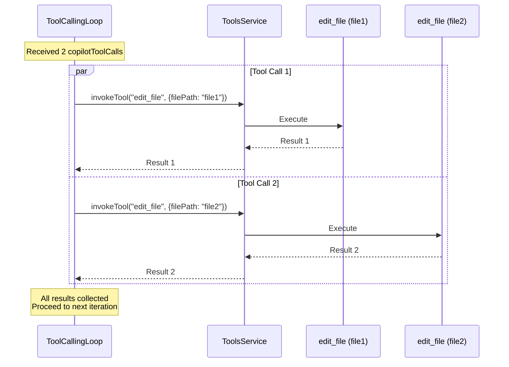

# VSCode Copilot Chat: Complete Workflow Documentation

## Table of Contents

1. [Overview](#overview)
2. [Prompt Building & Message Assembly](#prompt-building)
3. [Tools Registration & Exposure](#tools-registration)
4. [SSE Streaming & Response Parsing](#sse-streaming)
5. [Tool Invocation & Result Handling](#tool-invocation)
6. [Complete End-to-End Example](#complete-example)
7. [Workflow Sequence Diagram](#workflow-diagram)
8. [Key Code References](#code-references)

---

## Overview

This document provides a comprehensive, step-by-step description of how VSCode Copilot Chat implements its agentic workflow. This includes exact JSON payloads, request/response structures, SSE streaming events, and tool calling patterns.

**Purpose**: To understand the complete flow from user input to agent response with tool calling capabilities.

---

## 1. Prompt Building & Message Assembly {#prompt-building}

### Overview

The prompt building process in VSCode Copilot Chat is handled by the **PromptRenderer** system, which assembles system messages, user instructions, global context, and conversation history into a structured `messages` array that gets sent to the LLM endpoint. This section documents how prompts are constructed, collapsed, and converted for different providers.

### Key Components

**Primary File**: `src/extension/prompts/node/base/promptRenderer.ts`

The PromptRenderer is responsible for:

- Rendering prompt elements into `Raw.ChatMessage[]` objects
- Collapsing consecutive system messages into a single system message
- Token counting and budget management
- Converting provider-specific messages to internal format

### Step-by-Step Prompt Building Process

#### Step 1: System Messages Creation

System messages are created first and placed at the top of the messages array. They include:

- **Assistant identity and role** (e.g., "You are Copilot")
- **Safety guardrails** and content policies
- **Mode-specific instructions** (code assistant vs code + shell mode)
- **Experiment flags** and feature toggles

**Code Reference**: `src/extension/prompts/node/agent/agentPrompt.tsx`

System messages are typically rendered via prompt templates and then collapsed into a single system message to avoid sending multiple system role messages to the model.

**Collapsing Logic**: The PromptRenderer automatically collapses consecutive system messages:

```typescript
// From promptRenderer.ts - "Collapse consecutive system messages" logic
// Multiple system messages are merged into one to comply with provider requirements
```

For certain providers (e.g., Anthropic), system messages are further merged into a single `system` parameter rather than being included in the messages array.

**Code Reference**: `src/extension/byok/common/anthropicMessageConverter.ts`

- Function: `anthropicMessagesToRawMessages(messages, systemMessage)`
- Converts provider-specific system parameters to Raw messages

#### Step 2: Global Context Addition

After system messages, global context is added, which includes:

- **Workspace metadata** (workspace root, folder structure)
- **File changes** (git status, modified files)
- **Repository metadata** (current branch, repository info)
- **User settings and preferences**

This context is injected to give the model awareness of the development environment.

#### Step 3: User Message Construction

The user's actual query or task is inserted as a User role message. This includes:

- **The user's text prompt**
- **Attachments** (file references, code snippets)
- **Context mentions** (e.g., `@workspace`, `#file`)
- **Tool references** (available tools the model can use)

User messages can contain multiple content parts:

- Text content
- Image attachments (for vision-capable models)
- Code blocks
- File references

#### Step 4: Conversation History & Tool Results

Previous assistant messages, tool calls, and tool results are appended in chronological order:

1. **Past Assistant Messages**: Previous responses from the model
2. **Tool Call Messages**: Records of tools invoked by the model
3. **Tool Result Messages**: Results returned from tool executions

Tool results are represented as structured messages that the model can parse and use for the next iteration.

**Code Reference**: `src/extension/intents/node/toolCallingLoop.ts`

- Tool results are injected back into context via `createPromptContext` with `toolCallResults`

#### Step 5: Message Assembly Order

The final messages array follows this structure:

```
[
  { role: "system", content: "You are Copilot..." },           // System (collapsed)
  { role: "system", content: "Workspace: /home/..." },         // Global context
  { role: "user", content: "Open README.md and summarize" },   // User query
  { role: "assistant", content: "I'll read the file..." },     // Previous assistant
  { role: "assistant", tool_calls: [...] },                    // Tool calls
  { role: "tool", content: "...", tool_call_id: "..." }        // Tool results
]
```

### Provider-Specific Message Conversion

Different LLM providers require different message formats. The extension uses adapters to convert between internal `Raw.ChatMessage[]` format and provider-specific formats.

#### Anthropic Adapter Example

**Code Reference**: `src/extension/agents/node/adapters/anthropicAdapter.ts`

The Anthropic adapter performs bidirectional conversion:

**Raw → Anthropic**:

```typescript
// apiMessageToAnthropicMessage converts Raw messages to Anthropic format
// - Maps 'system' role to systemMessage parameter
// - Converts tool_use and tool_result blocks
// - Maps thinking blocks to Anthropic's extended thinking format
```

**Anthropic → Raw**:

```typescript
// anthropicMessagesToRawMessages converts Anthropic responses back
// - Extracts system text from systemMessage parameter
// - Maps tool_use blocks to Tool role messages
// - Preserves tool_result content with correct roles
```

**Code Reference**: `src/extension/byok/common/anthropicMessageConverter.ts`

### Message Content Types

Messages can contain various content types represented as blocks:

#### Text Content

```json
{
  "role": "assistant",
  "content": [{ "type": "text", "text": "Hello world" }]
}
```

#### Tool Use Block (Anthropic)

```json
{
  "role": "assistant",
  "content": [
    {
      "type": "tool_use",
      "id": "call123",
      "name": "read_file",
      "input": { "path": "README.md" }
    }
  ]
}
```

#### Tool Result Block (Anthropic)

```json
{
  "role": "user",
  "content": [
    {
      "type": "tool_result",
      "tool_use_id": "call123",
      "content": "File contents here..."
    }
  ]
}
```

#### Thinking Block (Extended Thinking)

```json
{
  "role": "assistant",
  "content": [
    {
      "type": "thinking",
      "thinking": "I need to analyze the file structure..."
    }
  ]
}
```

### Complete Prompt Request Body Example

Here's a complete example of a CAPI (OpenAI-style) request body:

```json
{
  "model": "gpt-4o-mini",
  "messages": [
    {
      "role": "system",
      "content": "You are Copilot, an AI coding assistant. You help developers write, understand, and improve code."
    },
    {
      "role": "system",
      "content": "Workspace: /home/user/project\nOpen files: src/main.ts, package.json\nGit branch: main (modified: 2 files)"
    },
    {
      "role": "user",
      "content": "Open the file README.md and summarize it."
    }
  ],
  "functions": [
    {
      "name": "readFile",
      "description": "Read a file from the workspace",
      "parameters": {
        "type": "object",
        "properties": {
          "path": {
            "type": "string",
            "description": "Relative path to the file"
          }
        },
        "required": ["path"]
      }
    }
  ],
  "temperature": 0.7,
  "max_tokens": 4096,
  "stream": true
}
```

### Anthropic Request Body Example

For Anthropic-specific endpoints:

```json
{
  "model": "claude-3-5-sonnet-20241022",
  "system": "You are Copilot, an AI coding assistant. Workspace: /home/user/project",
  "messages": [
    {
      "role": "user",
      "content": [
        {
          "type": "text",
          "text": "Open the file README.md and summarize it."
        }
      ]
    }
  ],
  "tools": [
    {
      "name": "read_file",
      "description": "Read a file from the workspace",
      "input_schema": {
        "type": "object",
        "properties": {
          "path": {
            "type": "string",
            "description": "Relative path to the file"
          }
        },
        "required": ["path"]
      }
    }
  ],
  "max_tokens": 4096,
  "temperature": 0.7,
  "stream": true
}
```

### Token Budget & Summarization

The PromptRenderer tracks token usage and enforces budget limits:

- **Token counting** is performed during prompt rendering
- If prompts exceed token limits, **summarization is triggered**
- Summarized prompts are rebuilt with condensed context
- Tool results and critical context are preserved

**Code Reference**: `src/extension/prompts/node/base/promptRenderer.ts`

- Method: `renderPromptElement` API for token-aware rendering

### Key Interfaces

#### Raw.ChatMessage Structure

```typescript
interface Raw.ChatMessage {
  role: 'system' | 'user' | 'assistant' | 'tool';
  content: string | ContentPart[];
  name?: string;           // For tool messages
  tool_call_id?: string;   // Links tool result to tool call
  tool_calls?: ToolCall[]; // For assistant tool invocations
}
```

#### ContentPart Union Type

```typescript
type ContentPart =
  | { type: "text"; text: string }
  | { type: "tool_use"; id: string; name: string; input: any }
  | { type: "tool_result"; tool_use_id: string; content: string }
  | { type: "thinking"; thinking: string }
  | { type: "image"; source: ImageSource };
```

### Special Considerations

#### Empty Prompts

If `buildPromptResult.messages.length === 0`, the fetch is short-circuited and no request is made.

#### Nested JSON in Tool Arguments

When tool arguments contain nested JSON strings, the validation code attempts to parse them recursively.

**Code Reference**: `src/extension/tools/common/toolsService.ts`

- Function: `validateToolInput` with nested JSON retry logic

#### Provider-Specific Limitations

- Some providers require a single system message (Anthropic)
- Some providers don't support the `tool` role directly
- Image attachments are only supported by vision-capable models

### Summary

The prompt building workflow follows this sequence:

1. **Render system messages** → Collapse consecutive system messages
2. **Add global context** → Workspace, files, git status
3. **Insert user message** → Query + attachments + context
4. **Append conversation history** → Assistant messages, tool calls, tool results
5. **Convert to provider format** → Anthropic, OpenAI, etc.
6. **Enforce token budget** → Summarize if needed
7. **Send as `messages` array** → To LLM endpoint via streaming request

All of this is orchestrated by `PromptRenderer` and provider-specific adapters, ensuring that prompts are correctly formatted for each LLM endpoint while maintaining a consistent internal representation.

---

## 2. Tools Registration & Exposure {#tools-registration}

### Overview

VSCode Copilot Chat exposes tools to language models through a structured registration and schema system. Tools are defined internally as `ICopilotTool` objects and converted to OpenAI-compatible function/tool schemas before being sent to LLM endpoints. This section documents how tools are defined, registered, and exposed to models.

### Key Components

**Primary Files**:

- `src/extension/tools/common/toolsRegistry.ts` - Tool registry and registration APIs
- `src/extension/tools/common/toolsService.ts` - Tool validation and invocation
- `src/extension/tools/vscode-node/toolsService.ts` - VS Code-specific tool service implementation
- `src/extension/intents/node/tools/getAgentTools.ts` - Tool selection for agent requests

### ICopilotTool Interface Structure

Tools are defined as objects implementing the `ICopilotTool` interface with the following properties:

```typescript
interface ICopilotTool {
  name: string; // Tool identifier (e.g., 'readFile')
  description: string; // Human-readable description
  inputSchema: JSONSchema; // JSON Schema for input validation
  implementation: ToolImplementation; // Actual tool execution function
}
```

**Example Tool Definition** (internal representation):

```typescript
{
  name: 'readFile',
  description: 'Read a file from the workspace',
  inputSchema: {
    type: 'object',
    properties: {
      path: {
        type: 'string',
        description: 'Relative path to the file'
      }
    },
    required: ['path']
  },
  implementation: async (input, context) => {
    // Tool execution logic here
    const fileContent = await readFileFromWorkspace(input.path);
    return { content: fileContent };
  }
}
```

### Tool Registry and getAgentTools

Tools are collected and managed through a centralized registry system.

**Code Reference**: `src/extension/intents/node/tools/getAgentTools.ts`

The `getAgentTools` function is responsible for:

1. Retrieving available tools from the registry
2. Filtering tools based on model capabilities
3. Filtering tools based on experiment flags
4. Filtering tools based on user preferences

**Tool Selection Logic**:

```typescript
// Pseudo-code representation of tool selection
function getAgentTools(modelCapabilities, experiments, preferences) {
  const allTools = ToolRegistry.getTools();

  return allTools.filter((tool) => {
    // Check if model supports tool calling
    if (!modelCapabilities.supportsToolCalling) return false;

    // Check if tool is enabled by experiments
    if (!experiments.isToolEnabled(tool.name)) return false;

    // Check if user has disabled this tool
    if (preferences.disabledTools.includes(tool.name)) return false;

    return true;
  });
}
```

**Important Note**: Some endpoints only support OpenAI's `functions` format, while others support the newer `tools` format. The extension adapts tool definitions accordingly based on endpoint capabilities.

**Code Reference**: `src/extension/intents/node/agentIntent.ts`

### Tool Schema Format: OpenAI Functions vs Copilot Tools

Tools are exposed to models in two primary formats depending on the endpoint type.

#### OpenAI Functions Format (Legacy)

Used by CAPI endpoints and OpenAI-compatible models. Tools are included in the `functions` field of the request body.

**Request Body Structure**:

```json
{
  "model": "gpt-4o-mini",
  "messages": [...],
  "functions": [
    {
      "name": "readFile",
      "description": "Read a file from the workspace",
      "parameters": {
        "type": "object",
        "properties": {
          "path": {
            "type": "string",
            "description": "Relative path to the file"
          }
        },
        "required": ["path"]
      }
    }
  ],
  "function_call": "auto"
}
```

**Key Fields**:

- `name`: Function identifier
- `description`: What the function does
- `parameters`: JSON Schema defining expected input structure
- `function_call`: Controls how model invokes functions (`"auto"`, `"none"`, or `{"name": "specificFunction"}`)

**Code Reference**: `src/platform/chat/common/chatMLFetcher.ts`

- Function: `createCapiRequestBody` converts internal tools to CAPI format

#### Copilot Tools Format (Extended)

Used by VS Code's LanguageModelChat API and newer endpoints. Tools are passed in the `tools` field with additional metadata.

**Request Body Structure**:

```json
{
  "model": "copilot-chat",
  "messages": [...],
  "tools": [
    {
      "type": "function",
      "function": {
        "name": "readFile",
        "description": "Read a file from the workspace",
        "parameters": {
          "type": "object",
          "properties": {
            "path": {
              "type": "string",
              "description": "Relative path to the file"
            }
          },
          "required": ["path"]
        }
      }
    }
  ],
  "tool_choice": "auto"
}
```

**Key Differences from Functions Format**:

- Tools are wrapped in a `{ type: "function", function: {...} }` structure
- Uses `tool_choice` instead of `function_call`
- Supports multiple tool types (function, retrieval, code_interpreter, etc.)
- Can include additional metadata like `toolInvocationToken`

**VS Code LanguageModel API Format**:

For extension-contributed LanguageModel endpoints, tools are passed via the `options.tools` field:

```typescript
// VS Code API structure
const options: vscode.LanguageModelChatOptions = {
  tools: [
    {
      name: "readFile",
      description: "Read a file from the workspace",
      inputSchema: {
        type: "object",
        properties: {
          path: { type: "string", description: "Relative path" },
        },
        required: ["path"],
      },
    },
  ],
};
```

**Code Reference**: `src/extension/agents/node/extChatEndpoint.ts`

- Adapter maps internal tool definitions to VS Code API format

### How Tools are Added to Request Body

The tool inclusion process varies by endpoint type:

#### CAPI/OpenAI Endpoints

**Code Reference**: `src/platform/networking/common/networking.ts`

1. Internal tool definitions are retrieved via `getAgentTools`
2. Each `ICopilotTool` is converted to OpenAI function schema
3. Functions are added to request body's `functions` field
4. The `function_call` parameter is set (usually `"auto"`)

**Conversion Example**:

```typescript
// Internal tool to OpenAI function conversion
function toOpenAIFunction(tool: ICopilotTool): OpenAIFunction {
  return {
    name: tool.name,
    description: tool.description,
    parameters: tool.inputSchema, // JSON Schema passes through directly
  };
}
```

**Code Reference**: `src/platform/chat/common/chatMLFetcher.ts`

- Function: `rawMessageToCAPI` handles conversion for CAPI endpoints

#### VS Code LanguageModel Endpoints

**Code Reference**: `src/extension/agents/node/extChatEndpoint.ts`

1. Tools are retrieved via `getAgentTools`
2. Each tool is adapted to `vscode.LanguageModelChatTool` format
3. Tools are passed in the `options.tools` array
4. The endpoint handles streaming with `LanguageModelToolCallPart` events

**Adaptation Process**:

```typescript
// Adapting to VS Code API
function adaptToVSCodeTool(tool: ICopilotTool): vscode.LanguageModelChatTool {
  return {
    name: tool.name,
    description: tool.description,
    inputSchema: tool.inputSchema,
  };
}
```

### Complete Request Body Examples

#### Example 1: CAPI Request with Multiple Functions

```json
{
  "model": "gpt-4o-mini",
  "messages": [
    { "role": "system", "content": "You are Copilot." },
    {
      "role": "user",
      "content": "List all TODOs in the repo and create a summary file."
    }
  ],
  "functions": [
    {
      "name": "grep_search",
      "description": "Search for text patterns across workspace files",
      "parameters": {
        "type": "object",
        "properties": {
          "query": {
            "type": "string",
            "description": "Text or regex pattern to search for"
          },
          "includePattern": {
            "type": "string",
            "description": "Glob pattern for files to include"
          }
        },
        "required": ["query"]
      }
    },
    {
      "name": "createFile",
      "description": "Create a new file with specified content",
      "parameters": {
        "type": "object",
        "properties": {
          "path": {
            "type": "string",
            "description": "Path where file should be created"
          },
          "content": {
            "type": "string",
            "description": "Content to write to the file"
          }
        },
        "required": ["path", "content"]
      }
    }
  ],
  "function_call": "auto",
  "temperature": 0.7,
  "stream": true
}
```

#### Example 2: Anthropic Request with Tools

```json
{
  "model": "claude-3-5-sonnet-20241022",
  "system": "You are Copilot, an AI coding assistant.",
  "messages": [
    {
      "role": "user",
      "content": [
        {
          "type": "text",
          "text": "Read package.json and show me the dependencies"
        }
      ]
    }
  ],
  "tools": [
    {
      "name": "read_file",
      "description": "Read a file from the workspace",
      "input_schema": {
        "type": "object",
        "properties": {
          "path": {
            "type": "string",
            "description": "Relative path to the file"
          }
        },
        "required": ["path"]
      }
    }
  ],
  "max_tokens": 4096,
  "stream": true
}
```

**Note**: Anthropic uses `input_schema` instead of `parameters` for tool definitions.

**Code Reference**: `src/extension/agents/node/adapters/anthropicAdapter.ts`

- Handles Anthropic-specific tool schema conversion

#### Example 3: VS Code LanguageModel Request

```typescript
// VS Code API request structure
const request = await vscode.lm.sendRequest(
  model,
  [vscode.LanguageModelChatMessage.User("Analyze this code file")],
  {
    tools: [
      {
        name: "readFile",
        description: "Read a file from the workspace",
        inputSchema: {
          type: "object",
          properties: {
            path: { type: "string", description: "File path" },
          },
          required: ["path"],
        },
      },
      {
        name: "list_code_usages",
        description: "Find usages of a symbol in the codebase",
        inputSchema: {
          type: "object",
          properties: {
            symbolName: { type: "string", description: "Symbol to search for" },
          },
          required: ["symbolName"],
        },
      },
    ],
  },
  cancellationToken,
);
```

### Tool Schema Validation

Before tools are invoked, their input arguments are validated against the defined JSON Schema using AJV (Another JSON Validator).

**Code Reference**: `src/extension/tools/common/toolsService.ts`

- Function: `validateToolInput`

**Validation Process**:

1. Parse tool arguments from model output (usually JSON string)
2. Validate against the tool's `inputSchema` using AJV
3. If validation fails and nested JSON detected, attempt recursive parsing
4. Return validated input or throw validation error

**Nested JSON Handling**:

Some models return tool arguments with nested JSON strings instead of proper objects. The validation code handles this:

```typescript
// Pseudo-code for nested JSON validation
function validateToolInput(toolName, argsString, schema) {
  let args = JSON.parse(argsString);

  // First validation attempt
  if (ajv.validate(schema, args)) {
    return args;
  }

  // If validation fails, try parsing nested JSON strings
  args = deepParseNestedJSON(args);

  if (ajv.validate(schema, args)) {
    return args;
  }

  throw new ValidationError("Invalid tool input");
}
```

### Tool Capability Detection

Not all models support tool calling. The extension checks model capabilities before exposing tools.

**Capability Checks**:

```typescript
// Pseudo-code for capability detection
function shouldIncludeTools(endpoint) {
  // Check if endpoint supports function calling
  if (!endpoint.capabilities.supportsFunctionCalling) {
    return false;
  }

  // Check if endpoint supports streaming tool calls
  if (!endpoint.capabilities.supportsStreamingToolCalls) {
    // Fall back to non-streaming tool call mode
    return true;
  }

  return true;
}
```

**Code Reference**: `src/extension/intents/node/agentIntent.ts`

### Tool Extension Hooks

Tools can have extension hooks for advanced scenarios:

- `resolveInput`: Pre-process tool input before validation
- `provideInput`: Prompt user for missing input parameters
- `filterEdits`: Post-process tool results

**Code Reference**: `src/extension/tools/common/toolsRegistry.ts`

- Interface: `ICopilotToolExtension`

### Common Built-in Tools

Examples of tools registered in the extension:

- `readFile` - Read file contents from workspace
- `applyPatch` - Apply code changes via unified diff
- `createFile` - Create new files
- `grep_search` - Search text patterns in workspace
- `list_code_usages` - Find symbol references
- `semantic_search` - Semantic code search
- `run_in_terminal` - Execute shell commands

**Code Reference**: `src/extension/tools/node/` directory

- Contains individual tool implementations (e.g., `readFileTool.tsx`, `applyPatchTool.tsx`)

### Tool Naming Conventions

**Internal Names**: Use camelCase (e.g., `readFile`, `createFile`)

**Contributed Tool Names**: Prefixed with contributor ID (e.g., `github_create_pull_request`)

**Mapping Function**: `getContributedToolName` and `mapContributedToolNamesInSchema` handle the conversion between internal and contributed tool names.

**Code Reference**: `src/extension/tools/vscode-node/toolsService.ts`

### Summary

The tool registration and exposure workflow:

1. **Tool Definition**: Tools are defined as `ICopilotTool` objects with name, description, and inputSchema
2. **Registry**: Tools are registered in a central ToolRegistry
3. **Selection**: `getAgentTools` filters tools based on model capabilities and settings
4. **Conversion**: Tools are converted to OpenAI functions or Copilot tools format
5. **Request Body**: Tools are added to `functions` or `tools` field in request payload
6. **Validation**: Input is validated using AJV against JSON Schema before invocation

The key difference between OpenAI functions and Copilot tools is primarily structural:

- **OpenAI Functions**: Flat structure with `functions` array and `parameters` field
- **Copilot Tools**: Nested structure with `tools` array containing `{ type: 'function', function: {...} }` and `tool_choice` control

Both formats use JSON Schema to define expected input structure, making tool definitions portable across different endpoint types.

---

## 3. SSE Streaming & Response Parsing {#sse-streaming}

### Overview

VSCode Copilot Chat uses Server-Sent Events (SSE) to stream responses from language models. The streaming layer parses SSE events, buffers partial tool calls, and normalizes them into `IResponseDelta` objects that are consumed by the UI and agent orchestration layers. This section documents the complete SSE flow, event types, delta structures, and parser behavior.

### Key Components

**Primary Files**:

- `src/platform/endpoint/node/stream.ts` - SSE parser and processor (SSEProcessor)
- `src/platform/networking/common/fetch.ts` - IResponseDelta interface definitions
- `src/platform/networking/common/responseConvert.ts` - Provider output to IResponseDelta mapping
- `src/platform/chat/common/chatMLFetcher.ts` - Streaming AsyncIterable management
- `src/extension/agents/node/adapters/anthropicAdapter.ts` - Anthropic SSE event formatting

### SSE Event Flow

#### Step 1: Request Initiation

The chat request is made with `stream: true` enabled in the request body. The endpoint begins streaming SSE data chunks.

**Code Reference**: `src/platform/networking/common/networking.ts`

**HTTP Request Headers**:

```
Authorization: Bearer <token>
X-Request-Id: <uuid>
OpenAI-Intent: chat
X-Interaction-Type: agent
Content-Type: application/json
Accept: text/event-stream
```

#### Step 2: SSE Event Types

The SSE stream consists of multiple event types depending on the provider (Anthropic, OpenAI, CAPI).

##### Anthropic SSE Event Sequence

Anthropic uses a block-based streaming format with the following event types:

1. **message_start** - Initial event marking the start of the response
2. **content_block_start** - Marks the start of a content block (text or tool_use)
3. **content_block_delta** - Incremental content updates (text_delta or input_json_delta)
4. **content_block_stop** - Marks the end of a content block
5. **message_delta** - Contains metadata like `stop_reason`
6. **message_stop** - Final event marking the end of the response

**Typical Sequence for Text Response**:

```
data: {"type":"message_start","message":{"id":"msg_123","role":"assistant","model":"claude-3-5-sonnet-20241022","content":[],"usage":{"input_tokens":245,"output_tokens":0}}}

data: {"type":"content_block_start","index":0,"content_block":{"type":"text","text":""}}

data: {"type":"content_block_delta","index":0,"delta":{"type":"text_delta","text":"Hello"}}

data: {"type":"content_block_delta","index":0,"delta":{"type":"text_delta","text":" world"}}

data: {"type":"content_block_stop","index":0}

data: {"type":"message_delta","delta":{"stop_reason":"end_turn"},"usage":{"output_tokens":2}}

data: {"type":"message_stop"}
```

**Typical Sequence for Tool Call Response**:

```
data: {"type":"message_start","message":{"id":"msg_456","role":"assistant","model":"claude-3-5-sonnet-20241022","content":[],"usage":{"input_tokens":350,"output_tokens":0}}}

data: {"type":"content_block_start","index":0,"content_block":{"type":"text","text":""}}

data: {"type":"content_block_delta","index":0,"delta":{"type":"text_delta","text":"I'll read that file for you."}}

data: {"type":"content_block_stop","index":0}

data: {"type":"content_block_start","index":1,"content_block":{"type":"tool_use","id":"tooluse_448k6WHnTpS28K0Bd1bhgA","name":"read_file","input":{}}}

data: {"type":"content_block_delta","index":1,"delta":{"type":"input_json_delta","partial_json":"{\"path\":\""}}

data: {"type":"content_block_delta","index":1,"delta":{"type":"input_json_delta","partial_json":"README.md"}}

data: {"type":"content_block_delta","index":1,"delta":{"type":"input_json_delta","partial_json":"\"}"}}

data: {"type":"content_block_stop","index":1}

data: {"type":"message_delta","delta":{"stop_reason":"tool_use"},"usage":{"output_tokens":45}}

data: {"type":"message_stop"}
```

**Code Reference**: `src/extension/agents/node/adapters/anthropicAdapter.ts`

- Function: `formatStreamResponse` - Converts internal stream blocks to Anthropic SSE events

##### OpenAI/CAPI SSE Event Format

OpenAI-compatible endpoints use a different event structure:

**Text Response**:

```
data: {"id":"chatcmpl-123","object":"chat.completion.chunk","created":1234567890,"model":"gpt-4o-mini","choices":[{"index":0,"delta":{"role":"assistant","content":"Hello"},"finish_reason":null}]}

data: {"id":"chatcmpl-123","object":"chat.completion.chunk","created":1234567890,"model":"gpt-4o-mini","choices":[{"index":0,"delta":{"content":" world"},"finish_reason":null}]}

data: {"id":"chatcmpl-123","object":"chat.completion.chunk","created":1234567890,"model":"gpt-4o-mini","choices":[{"index":0,"delta":{},"finish_reason":"stop"}]}

data: [DONE]
```

**Function Call Response** (OpenAI legacy format):

```
data: {"id":"chatcmpl-456","choices":[{"index":0,"delta":{"function_call":{"name":"readFile","arguments":""}},"finish_reason":null}]}

data: {"id":"chatcmpl-456","choices":[{"index":0,"delta":{"function_call":{"arguments":"{\"path\":"}},"finish_reason":null}]}

data: {"id":"chatcmpl-456","choices":[{"index":0,"delta":{"function_call":{"arguments":"\"README.md\"}"}},"finish_reason":null}]}

data: {"id":"chatcmpl-456","choices":[{"index":0,"delta":{},"finish_reason":"function_call"}]}

data: [DONE]
```

**Tool Calls Response** (OpenAI tool_calls format):

```
data: {"id":"chatcmpl-789","choices":[{"index":0,"delta":{"tool_calls":[{"index":0,"id":"call_abc123","type":"function","function":{"name":"readFile","arguments":""}}]},"finish_reason":null}]}

data: {"id":"chatcmpl-789","choices":[{"index":0,"delta":{"tool_calls":[{"index":0,"function":{"arguments":"{\"path\":"}}]},"finish_reason":null}]}

data: {"id":"chatcmpl-789","choices":[{"index":0,"delta":{"tool_calls":[{"index":0,"function":{"arguments":"\"README.md\"}"}}]},"finish_reason":null}]}

data: {"id":"chatcmpl-789","choices":[{"index":0,"delta":{},"finish_reason":"tool_calls"}]}

data: [DONE]
```

**Code Reference**: `src/platform/endpoint/node/stream.ts`

- Class: `SSEProcessor` - Parses OpenAI-style SSE events

#### Step 3: IResponseDelta Structure

All SSE events are normalized into `IResponseDelta` objects regardless of the provider format.

**Code Reference**: `src/platform/networking/common/fetch.ts`

**IResponseDelta Interface**:

```typescript
interface IResponseDelta {
  // Incremental text content
  text?: string;

  // Tool call signals
  beginToolCalls?: IBeginToolCall[]; // Signals model will call tools
  copilotToolCalls?: ICopilotToolCall[]; // Complete tool call objects

  // Model thinking (extended thinking models)
  thinking?: string;

  // Stateful markers for multi-turn context
  statefulMarker?: string;

  // Error handling
  copilotErrors?: ICopilotError[];
  retryReason?: string;

  // Citations and annotations
  ipCitations?: IPCitation[];
  codeVulnAnnotations?: ICodeVulnAnnotation[];

  // Usage metadata
  usage?: {
    input_tokens?: number;
    output_tokens?: number;
  };
}
```

**ICopilotToolCall Structure**:

```typescript
interface ICopilotToolCall {
  id: string; // Unique tool call identifier (e.g., "call_abc123")
  name: string; // Tool name (e.g., "read_file")
  arguments: string; // JSON-stringified tool arguments
}
```

**IBeginToolCall Structure**:

```typescript
interface IBeginToolCall {
  name: string; // Tool name that will be called
}
```

#### Step 4: SSE Parsing and Buffering

The SSE parser (`SSEProcessor`) reads the event stream and handles partial JSON assembly.

**Code Reference**: `src/platform/endpoint/node/stream.ts`

##### Parser Responsibilities

1. **Parse SSE Data Lines**: Extract JSON payloads from `data:` lines
2. **Buffer Partial Tool Calls**: Accumulate `function_call.arguments` or `tool_calls[].function.arguments` chunks
3. **Detect beginToolCalls**: Emit `beginToolCalls` marker when model transitions to tool calling
4. **Assemble Complete Tool Calls**: Combine partial JSON chunks into complete tool call objects
5. **Emit IResponseDelta Objects**: Normalize provider-specific events to unified delta format

##### Partial JSON Buffering

Tool call arguments often arrive in multiple chunks due to streaming:

**Example Chunk Sequence**:

```
Chunk 1: {"function_call":{"arguments":"{"}}
Chunk 2: {"function_call":{"arguments":"\"path\":"}}
Chunk 3: {"function_call":{"arguments":"\"README"}}
Chunk 4: {"function_call":{"arguments":".md\""}}
Chunk 5: {"function_call":{"arguments":"}"}}
```

The parser buffers these chunks and only emits a complete `copilotToolCalls` entry when the tool call is finished (indicated by `finish_reason` or `content_block_stop`).

**Parser Buffer Logic**:

```typescript
// Pseudo-code representation
class SSEProcessor {
  private functionCallBuffer: { name?: string; arguments: string } = {
    arguments: "",
  };
  private toolCallsBuffer: Map<
    number,
    { id?: string; name?: string; arguments: string }
  > = new Map();

  processDelta(delta: any): IResponseDelta {
    // Handle function_call deltas (legacy OpenAI format)
    if (delta.function_call) {
      if (delta.function_call.name) {
        this.functionCallBuffer.name = delta.function_call.name;
      }
      if (delta.function_call.arguments) {
        this.functionCallBuffer.arguments += delta.function_call.arguments;
      }
    }

    // Handle tool_calls deltas (new OpenAI format)
    if (delta.tool_calls) {
      for (const toolCallDelta of delta.tool_calls) {
        const index = toolCallDelta.index || 0;
        let buffer = this.toolCallsBuffer.get(index) || { arguments: "" };

        if (toolCallDelta.id) buffer.id = toolCallDelta.id;
        if (toolCallDelta.function?.name)
          buffer.name = toolCallDelta.function.name;
        if (toolCallDelta.function?.arguments) {
          buffer.arguments += toolCallDelta.function.arguments;
        }

        this.toolCallsBuffer.set(index, buffer);
      }
    }

    // Return normalized delta
    return {
      text: delta.content || "",
      // Other fields populated based on delta content
    };
  }

  finalizeToolCalls(): ICopilotToolCall[] {
    // Called when finish_reason indicates tool calls are complete
    const toolCalls: ICopilotToolCall[] = [];

    // Legacy function_call format
    if (this.functionCallBuffer.name) {
      toolCalls.push({
        id: generateId(),
        name: this.functionCallBuffer.name,
        arguments: this.functionCallBuffer.arguments,
      });
    }

    // New tool_calls format
    for (const [index, buffer] of this.toolCallsBuffer.entries()) {
      toolCalls.push({
        id: buffer.id || generateId(),
        name: buffer.name || "",
        arguments: buffer.arguments,
      });
    }

    return toolCalls;
  }
}
```

**Code Reference**: `src/platform/endpoint/node/stream.ts`

- Method: `processDelta` handles incremental delta processing
- Method: `finalize` assembles complete tool calls

##### beginToolCalls Detection

The parser emits `beginToolCalls` when:

1. The model starts emitting `function_call` or `tool_calls` deltas
2. The response already contains text content (signals transition)
3. This is the first tool call in the current response

**Detection Logic**:

```typescript
// Pseudo-code
function detectBeginToolCalls(
  delta: any,
  currentText: string,
): IBeginToolCall[] | undefined {
  // Check if this is the first tool call delta
  const isFirstToolCall = !this.hasSeenToolCalls;

  // Check if we're transitioning from text to tool calls
  const hasExistingText = currentText.length > 0;

  if (isFirstToolCall && (delta.function_call || delta.tool_calls)) {
    this.hasSeenToolCalls = true;

    // Extract tool name from delta
    const toolName =
      delta.function_call?.name || delta.tool_calls?.[0]?.function?.name;

    if (hasExistingText && toolName) {
      return [{ name: toolName }];
    }
  }

  return undefined;
}
```

**Code Reference**: `src/platform/endpoint/node/stream.ts`

- The parser emits `beginToolCalls` via the solution object

#### Step 5: Complete SSE Event Trace Example

Below is a complete end-to-end trace showing how an Anthropic SSE stream is parsed into `IResponseDelta` objects.

**Scenario**: User asks to edit two files. Model streams text, then calls `edit_file` tool twice.

##### Raw SSE Stream (Anthropic Format):

```
data: {"type":"message_start","message":{"id":"msg_01ABC","role":"assistant","model":"claude-3-5-sonnet-20241022","content":[],"usage":{"input_tokens":450,"output_tokens":0}}}

data: {"type":"content_block_start","index":0,"content_block":{"type":"text","text":""}}

data: {"type":"content_block_delta","index":0,"delta":{"type":"text_delta","text":"I'll make two changes:\n1. Add a multiply function to test.js\n2. Modify server.js to return dad jokes"}}

data: {"type":"content_block_stop","index":0}

data: {"type":"content_block_start","index":1,"content_block":{"type":"tool_use","id":"tooluse_448k6WHnTpS28K0Bd1bhgA","name":"edit_file","input":{}}}

data: {"type":"content_block_delta","index":1,"delta":{"type":"input_json_delta","partial_json":"{\"filePath\":\"/path/test.js\",\"code\":\"function multiply(a,b) { return a*b; }\""}}

data: {"type":"content_block_delta","index":1,"delta":{"type":"input_json_delta","partial_json":"}"}}

data: {"type":"content_block_stop","index":1}

data: {"type":"content_block_start","index":2,"content_block":{"type":"tool_use","id":"tooluse_2SRF2HShTXOoLdGrjWuGiw","name":"edit_file","input":{}}}

data: {"type":"content_block_delta","index":2,"delta":{"type":"input_json_delta","partial_json":"{\"filePath\":\"/path/server.js\",\"code\":\"const jokes = ['Why did the chicken cross the road?', 'To get to the other side!']; app.get('/', (req, res) => res.send(jokes[Math.floor(Math.random() * jokes.length)]));\"}"}}

data: {"type":"content_block_stop","index":2}

data: {"type":"message_delta","delta":{"stop_reason":"tool_use"},"usage":{"output_tokens":156}}

data: {"type":"message_stop"}
```

##### Parsed IResponseDelta Sequence:

The SSE parser converts these events into the following `IResponseDelta` objects passed to `finishedCb`:

**Delta 1 - Text Content**:

```json
{
  "text": "I'll make two changes:\n1. Add a multiply function to test.js\n2. Modify server.js to return dad jokes",
  "index": 0,
  "delta": {
    "text": "I'll make two changes:\n1. Add a multiply function to test.js\n2. Modify server.js to return dad jokes"
  }
}
```

**Delta 2 - Begin Tool Calls Marker**:

```json
{
  "text": "",
  "index": 0,
  "delta": {
    "text": "",
    "beginToolCalls": [{ "name": "edit_file" }]
  }
}
```

**Delta 3 - Complete Tool Calls**:

```json
{
  "text": "",
  "index": 0,
  "delta": {
    "text": "",
    "copilotToolCalls": [
      {
        "name": "edit_file",
        "arguments": "{\"filePath\":\"/path/test.js\",\"code\":\"function multiply(a,b) { return a*b; }\"}",
        "id": "tooluse_448k6WHnTpS28K0Bd1bhgA"
      },
      {
        "name": "edit_file",
        "arguments": "{\"filePath\":\"/path/server.js\",\"code\":\"const jokes = ['Why did the chicken cross the road?', 'To get to the other side!']; app.get('/', (req, res) => res.send(jokes[Math.floor(Math.random() * jokes.length)]));\"}",
        "id": "tooluse_2SRF2HShTXOoLdGrjWuGiw"
      }
    ]
  }
}
```

**Code Reference**: `src/platform/endpoint/test/node/__snapshots__/stream.sseProcessor.spec.ts.snap`

- Contains test snapshots showing exact `finishedCallback chunks` for various scenarios

#### Step 6: Adapter-Specific Event Generation

Each provider adapter is responsible for converting internal stream blocks to provider-specific SSE events.

##### Anthropic Adapter Event Generation

**Code Reference**: `src/extension/agents/node/adapters/anthropicAdapter.ts`

The `AnthropicAdapter.formatStreamResponse` method converts internal `IAgentStreamBlock` objects to Anthropic SSE events:

**For Text Blocks**:

```typescript
// Internal: { type: 'text', text: 'Hello world' }
// Generates SSE events:
// 1. content_block_start (if first text in block)
// 2. content_block_delta with text_delta
// 3. content_block_stop (when block complete)
```

**For Tool Call Blocks**:

```typescript
// Internal: { type: 'tool_call', name: 'read_file', arguments: {...}, id: 'call123' }
// Generates SSE events:
// 1. content_block_start with type: 'tool_use'
// 2. content_block_delta with input_json_delta containing serialized arguments
// 3. content_block_stop
```

**Code Implementation** (simplified):

```typescript
formatStreamResponse(streamData: IAgentStreamBlock): IStreamEventData[] {
  const events: IStreamEventData[] = [];

  if (streamData.type === 'text') {
    if (!this.currentBlockStarted) {
      events.push({
        event: 'content_block_start',
        data: { type: 'content_block_start', index: 0, content_block: { type: 'text', text: '' } }
      });
      this.currentBlockStarted = true;
    }

    events.push({
      event: 'content_block_delta',
      data: { type: 'content_block_delta', index: 0, delta: { type: 'text_delta', text: streamData.text } }
    });
  }

  if (streamData.type === 'tool_call') {
    events.push({
      event: 'content_block_start',
      data: {
        type: 'content_block_start',
        index: this.toolCallIndex,
        content_block: { type: 'tool_use', id: streamData.id, name: streamData.name, input: {} }
      }
    });

    events.push({
      event: 'content_block_delta',
      data: {
        type: 'content_block_delta',
        index: this.toolCallIndex,
        delta: { type: 'input_json_delta', partial_json: JSON.stringify(streamData.arguments) }
      }
    });

    events.push({
      event: 'content_block_stop',
      data: { type: 'content_block_stop', index: this.toolCallIndex }
    });

    this.toolCallIndex++;
  }

  return events;
}
```

##### Initial and Final Events

Adapters also generate initial and final events to bookend the response:

**Initial Events** (`generateInitialEvents`):

- `message_start` with usage metadata and model info

**Final Events** (`generateFinalEvents`):

- `message_delta` with `stop_reason` (e.g., `"tool_use"`, `"end_turn"`)
- `message_stop`

**Code Reference**: `src/extension/agents/node/adapters/anthropicAdapter.ts`

- Method: `generateInitialEvents`
- Method: `generateFinalEvents`

#### Step 7: FinishedCallback Integration

The parsed `IResponseDelta` objects are passed to the `finishedCb` callback registered by `ToolCallingLoop`.

**Code Reference**: `src/extension/intents/node/toolCallingLoop.ts`

**ToolCallingLoop FinishedCallback**:

```typescript
// Simplified representation
const finishedCb = (text: string, index: number, delta: IResponseDelta) => {
  // Accumulate text content
  if (delta.text) {
    responseText += delta.text;
  }

  // Detect begin tool calls
  if (delta.beginToolCalls) {
    this.onBeginToolCalls(delta.beginToolCalls);
  }

  // Collect complete tool calls
  if (delta.copilotToolCalls) {
    for (const toolCall of delta.copilotToolCalls) {
      toolCalls.push({
        id: this.createInternalToolCallId(toolCall.id),
        name: toolCall.name,
        arguments: toolCall.arguments,
      });
    }
  }

  // Track thinking deltas
  if (delta.thinking) {
    thinkingContent += delta.thinking;
  }

  // Store stateful marker for next request
  if (delta.statefulMarker) {
    statefulMarker = delta.statefulMarker;
  }

  // Update UI with streaming content
  this.updateUI(responseText, toolCalls);
};
```

#### Step 8: Finish Reasons and Completion

SSE streams end with a `finish_reason` that indicates why the model stopped generating:

**Common Finish Reasons**:

- `stop` / `end_turn` - Model completed response naturally
- `tool_calls` / `tool_use` - Model requested tool invocations
- `function_call` - Model requested function call (legacy OpenAI format)
- `length` / `max_tokens` - Hit token limit
- `content_filter` - Content policy violation

**Code Reference**: `src/platform/endpoint/node/stream.ts`

- Enum: `FinishedCompletionReason`

**FinishedCompletion Object**:

```typescript
interface FinishedCompletion {
  reason: FinishedCompletionReason;
  toolCalls?: ICopilotToolCall[];
  functionCall?: { name: string; arguments: string };
  usage?: { input_tokens: number; output_tokens: number };
}
```

When the SSE stream completes, the parser emits a `FinishedCompletion` object via the solution's `emitSolution` method, which triggers the `ToolCallingLoop` to process the collected tool calls.

### Edge Cases and Error Handling

#### Malformed JSON in Tool Arguments

If the buffered tool call arguments cannot be parsed as valid JSON:

1. The parser attempts to repair common JSON syntax errors
2. If repair fails, an error is logged and the tool call may be skipped
3. The agent may prompt the model to retry with corrected arguments

**Code Reference**: `src/extension/tools/common/toolsService.ts`

- Function: `validateToolInput` with JSON parsing error handling

#### Partial Deltas with Incomplete Arguments

If the stream is interrupted before `finish_reason` is received:

1. Buffered tool calls remain incomplete
2. The parser does not emit `copilotToolCalls` for incomplete calls
3. The agent may retry the request or fail gracefully

#### Multiple Choices

Some endpoints support multiple completion choices in parallel. The parser tracks `expectedNumChoices` and processes each choice independently:

```typescript
// Multiple choices example (OpenAI format)
data: {"choices":[
  {"index":0,"delta":{"content":"Response A"}},
  {"index":1,"delta":{"content":"Response B"}}
]}
```

**Code Reference**: `src/platform/endpoint/node/stream.ts`

- The parser maintains separate state per choice index

#### Empty Responses

If the model returns an empty response (no text, no tool calls):

1. The parser emits minimal deltas
2. `ToolCallingLoop` detects empty response and may log a warning
3. The agent may fall back to a default response

### Test Snapshots and Examples

The repository includes comprehensive test snapshots showing real SSE sequences:

**Code Reference**: `src/platform/endpoint/test/node/__snapshots__/stream.sseProcessor.spec.ts.snap`

**Example Test Case**: "processes tool calls with text before beginToolCalls"

This snapshot shows:

1. Initial text deltas
2. `beginToolCalls` marker
3. Multiple `copilotToolCalls` entries
4. Complete tool call arguments assembled from partial chunks

### Summary

The SSE streaming and parsing workflow:

1. **Request Made**: Client sends request with `stream: true`
2. **SSE Events Stream**: Provider sends events (`message_start`, `content_block_delta`, etc.)
3. **Parser Buffers**: `SSEProcessor` accumulates partial tool call arguments
4. **Detection**: Parser detects `beginToolCalls` when transitioning to tool mode
5. **Assembly**: Complete tool calls assembled when `finish_reason` received
6. **Normalization**: Provider-specific events converted to `IResponseDelta` objects
7. **Callback**: `finishedCb` receives deltas with `text`, `beginToolCalls`, `copilotToolCalls`
8. **Collection**: `ToolCallingLoop` collects tool calls for invocation

The key insight is that tool call arguments arrive as **partial JSON chunks** across multiple SSE events, and the parser must **buffer and concatenate** these chunks before emitting complete tool call objects. The `beginToolCalls` marker signals the UI to prepare for tool invocation before the complete arguments have been received.

**Provider Differences**:

- **Anthropic**: Uses `content_block_*` events with `input_json_delta` for tool arguments
- **OpenAI**: Uses `tool_calls` array deltas with `function.arguments` increments
- **Legacy OpenAI**: Uses single `function_call` object with `arguments` increments

All formats are normalized to the same `IResponseDelta` structure with `copilotToolCalls` arrays for consistent downstream processing.

---

## 4. Tool Invocation & Result Handling {#tool-invocation}

### Overview

Once the SSE parser has collected complete tool calls from streaming deltas, the **ToolCallingLoop** orchestrates tool invocation through validation, execution, and result injection back into the conversation. This section documents the complete flow from tool call detection to result reinjection, including validation with AJV, invocation via ToolsService, and the loop continuation/termination logic.

### Key Components

**Primary Files**:

- `src/extension/intents/node/toolCallingLoop.ts` - Main orchestration loop
- `src/extension/tools/common/toolsService.ts` - Base tool service with validation
- `src/extension/tools/vscode-node/toolsService.ts` - VS Code-specific tool invocation
- `src/extension/tools/registry.ts` - Tool registry and lookup

### Step-by-Step Tool Invocation Flow

#### Step 1: Tool Call Collection in ToolCallingLoop

The `ToolCallingLoop.runOne` method sets up a `finishedCb` callback that collects tool calls from streaming deltas.

**Code Reference**: `src/extension/intents/node/toolCallingLoop.ts` - `runOne()` method

**Collection Logic**:

```typescript
// Simplified representation from ToolCallingLoop.runOne
const toolCalls: IToolCall[] = [];
let statefulMarker: string | undefined;
let thinkingContent: string = "";

const finishedCb = (text: string, index: number, delta: IResponseDelta) => {
  // Collect tool calls from delta
  if (delta.copilotToolCalls) {
    for (const call of delta.copilotToolCalls) {
      toolCalls.push({
        id: this.createInternalToolCallId(call.id),
        name: call.name,
        arguments: call.arguments, // JSON string
        callId: call.id,
      });
    }
  }

  // Capture stateful marker for next round
  if (delta.statefulMarker) {
    statefulMarker = delta.statefulMarker;
  }

  // Track thinking metadata
  if (delta.thinking) {
    thinkingContent += delta.thinking;
  }

  // Update UI with streaming progress
  this.updateStreamingResponse(text, delta);
};
```

**ICopilotToolCall Structure** (from deltas):

```json
{
  "id": "tooluse_448k6WHnTpS28K0Bd1bhgA",
  "name": "edit_file",
  "arguments": "{\"filePath\":\"/path/test.js\",\"code\":\"function multiply(a,b) { return a*b; }\"}"
}
```

**IToolCall Structure** (internal representation):

```typescript
interface IToolCall {
  id: string; // Internal tool call ID
  name: string; // Tool name (e.g., "edit_file")
  arguments: string; // JSON-stringified arguments
  callId: string; // Original call ID from model
}
```

#### Step 2: ToolCallRound Creation

When the fetch completes, the `ToolCallingLoop` creates a `ToolCallRound` object that encapsulates:

- The prompt messages sent to the model
- The model's response (text + tool calls)
- Stateful markers for context preservation
- Thinking metadata (if extended thinking enabled)

**Code Reference**: `src/extension/intents/node/toolCallingLoop.ts` - `ToolCallRound.create()` method

**ToolCallRound Structure**:

```typescript
interface ToolCallRound {
  prompt: Raw.ChatMessage[]; // Messages sent to model
  response: string; // Model's text response
  toolCalls: IToolCall[]; // Tool calls from model
  statefulMarker?: string; // Context marker for next round
  thinking?: ThinkingDataItem; // Extended thinking data
  timestamp: number; // Round creation time
}
```

**Example ToolCallRound**:

```json
{
  "prompt": [
    { "role": "system", "content": "You are Copilot..." },
    { "role": "user", "content": "Add multiply function to test.js" }
  ],
  "response": "I'll add the multiply function for you.",
  "toolCalls": [
    {
      "id": "internal_call_1",
      "name": "edit_file",
      "arguments": "{\"filePath\":\"test.js\",\"code\":\"function multiply(a,b){return a*b;}\"}",
      "callId": "tooluse_448k6WHnTpS28K0Bd1bhgA"
    }
  ],
  "statefulMarker": "marker_abc123",
  "timestamp": 1699876543210
}
```

The `ToolCallRound` is appended to `this.toolCallRounds[]` array for tracking conversation history.

#### Step 3: Tool Input Validation with AJV

Before invoking any tool, the `ToolsService.validateToolInput` method validates the arguments against the tool's JSON Schema using AJV (Another JSON Validator).

**Code Reference**: `src/extension/tools/common/toolsService.ts` - `validateToolInput` method

**Validation Process**:

1. Parse the `arguments` string into a JavaScript object
2. Retrieve the tool's `inputSchema` from the registry
3. Validate the parsed arguments against the schema using AJV
4. If validation fails and nested JSON detected, attempt recursive parsing
5. Return validated input or throw `IToolValidationError`

**Validation Logic** (simplified):

```typescript
// From BaseToolsService.validateToolInput
function validateToolInput(
  toolName: string,
  argumentsString: string,
  schema: JSONSchema,
): any {
  // Step 1: Parse arguments string
  let args = JSON.parse(argumentsString);

  // Step 2: First validation attempt
  const valid = ajv.validate(schema, args);
  if (valid) {
    return args;
  }

  // Step 3: Handle nested JSON strings
  // Some models return nested JSON like: { "path": "{\"file\":\"test.js\"}" }
  args = deepParseNestedJSON(args);

  // Step 4: Retry validation after nested parsing
  const validAfterParsing = ajv.validate(schema, args);
  if (validAfterParsing) {
    return args;
  }

  // Step 5: Validation failed
  throw new ToolValidationError({
    toolName,
    errors: ajv.errors,
    receivedInput: args,
  });
}
```

**Nested JSON Parsing**:

```typescript
// Pseudo-code for nested JSON parsing
function deepParseNestedJSON(obj: any): any {
  if (typeof obj === "string") {
    try {
      // Try to parse the string as JSON
      return deepParseNestedJSON(JSON.parse(obj));
    } catch {
      // Not JSON, return as-is
      return obj;
    }
  }

  if (Array.isArray(obj)) {
    return obj.map(deepParseNestedJSON);
  }

  if (obj !== null && typeof obj === "object") {
    const result: any = {};
    for (const [key, value] of Object.entries(obj)) {
      result[key] = deepParseNestedJSON(value);
    }
    return result;
  }

  return obj;
}
```

**Validation Error Structure**:

```typescript
interface IToolValidationError {
  toolName: string;
  errors: AJVError[]; // AJV validation errors
  receivedInput: any; // The input that failed validation
}
```

**Example Validation Error**:

```json
{
  "toolName": "edit_file",
  "errors": [
    {
      "instancePath": "/filePath",
      "schemaPath": "#/properties/filePath/type",
      "keyword": "type",
      "params": { "type": "string" },
      "message": "must be string"
    }
  ],
  "receivedInput": {
    "filePath": 123,
    "code": "function test() {}"
  }
}
```

#### Step 4: Tool Invocation via ToolsService

After validation succeeds, the tool is invoked via `ToolsService.invokeTool`.

**Code Reference**:

- `src/extension/tools/common/toolsService.ts` - Base invocation logic
- `src/extension/tools/vscode-node/toolsService.ts` - VS Code-specific implementation

**Invocation Methods**:

The extension supports two invocation paths:

1. **VS Code Language Model Tools** (`vscode.lm.invokeTool`) - For contributed tools
2. **Extension-owned ICopilotTool** - For built-in tools

**VS Code LM Tool Invocation**:

```typescript
// From VscodeToolsService.invokeTool
async invokeTool(
  name: string,
  options: vscode.LanguageModelToolInvocationOptions<Object>,
  token: vscode.CancellationToken
): Promise<vscode.LanguageModelToolResult2> {
  // Fire pre-invocation event
  this._onWillInvokeTool.fire({ toolName: name });

  // Map to contributed tool name (e.g., "github_create_pull_request")
  const contributedName = getContributedToolName(name);

  // Invoke via VS Code API
  const result = await vscode.lm.invokeTool(
    contributedName,
    options,
    token
  );

  // Fire post-invocation event
  this._onDidInvokeTool.fire({ toolName: name, result });

  return result;
}
```

**Tool Invocation Options**:

```typescript
interface LanguageModelToolInvocationOptions<T> {
  input: T; // Validated tool input
  toolInvocationToken?: string; // Optional invocation token
  tokenizationOptions?: {
    // Token counting options
    countPromptTokens: boolean;
  };
}
```

**Example Invocation Call**:

```typescript
// Invoking the read_file tool
const result = await toolsService.invokeTool(
  "read_file",
  {
    input: {
      path: "README.md",
    },
    toolInvocationToken: "token_abc123",
  },
  cancellationToken,
);
```

**Extension-owned Tool Invocation**:

For built-in tools, the service retrieves the `ICopilotTool` implementation from the registry:

```typescript
// From BaseToolsService
async invokeExtensionTool(
  toolCall: IToolCall,
  context: IToolInvocationContext
): Promise<LanguageModelToolResult2> {
  // Get tool implementation
  const tool = this.getCopilotTool(toolCall.name);
  if (!tool) {
    throw new Error(`Tool not found: ${toolCall.name}`);
  }

  // Parse and validate input
  const input = this.validateToolInput(
    toolCall.name,
    toolCall.arguments,
    tool.inputSchema
  );

  // Execute tool implementation
  const result = await tool.implementation(input, context);

  return result;
}
```

#### Step 5: LanguageModelToolResult Structure

Tools return results in the `LanguageModelToolResult` or `LanguageModelToolResult2` format.

**LanguageModelToolResult2 Interface**:

```typescript
interface LanguageModelToolResult2 {
  content: LanguageModelToolResultContent[]; // Array of content parts
}

type LanguageModelToolResultContent =
  | LanguageModelTextPart
  | LanguageModelPromptTsxPart;

interface LanguageModelTextPart {
  type: "text";
  value: string; // Text content
}

interface LanguageModelPromptTsxPart {
  type: "prompt-tsx";
  value: any; // TSX component for rendering
}
```

**Example Tool Result** (read_file tool):

```json
{
  "content": [
    {
      "type": "text",
      "value": "# My Project\n\nThis is a sample README file.\n\n## Installation\n\nRun `npm install` to install dependencies."
    }
  ]
}
```

**Example Tool Result with Multiple Parts**:

```json
{
  "content": [
    {
      "type": "text",
      "value": "Found 3 TODO items in the codebase:"
    },
    {
      "type": "text",
      "value": "1. src/main.ts:45 - TODO: Implement error handling"
    },
    {
      "type": "text",
      "value": "2. src/utils.ts:12 - TODO: Add input validation"
    },
    {
      "type": "text",
      "value": "3. test/main.spec.ts:89 - TODO: Add more test cases"
    }
  ]
}
```

**Legacy LanguageModelToolResult** (older format):

```typescript
interface LanguageModelToolResult {
  content: string; // Plain text content
}
```

#### Step 6: Tool Result Storage and Injection

After tool invocation completes, the result is stored in `this.toolCallResults` keyed by the tool call ID.

**Code Reference**: `src/extension/intents/node/toolCallingLoop.ts`

**Tool Results Storage**:

```typescript
// In ToolCallingLoop
private toolCallResults: Record<string, LanguageModelToolResult2> = {};

// After tool invocation
for (const toolCall of toolCalls) {
  const result = await this.toolsService.invokeTool(
    toolCall.name,
    { input: validatedInput },
    this.cancellationToken
  );

  // Store result keyed by internal tool call ID
  this.toolCallResults[toolCall.id] = result;
}
```

**Result Injection into Prompt**:

Tool results are injected back into the conversation as **Tool role messages** when building the next prompt.

**Code Reference**: `src/extension/intents/node/toolCallingLoop.ts` - `createPromptContext` method

**Prompt Context with Tool Results**:

```typescript
interface IPromptContext {
  messages: Raw.ChatMessage[]; // Conversation history
  toolCallResults: Record<string, LanguageModelToolResult2>; // Tool results
  statefulMarker?: string; // Context marker
}
```

**Tool Message Format** (added to messages array):

```typescript
// Raw.ChatMessage with Tool role
{
  role: 'tool',
  content: [
    {
      type: 'text',
      text: '# My Project\n\nThis is a sample README file...'
    }
  ],
  tool_call_id: 'tooluse_448k6WHnTpS28K0Bd1bhgA',
  name: 'read_file'
}
```

**Anthropic Tool Result Block**:

For Anthropic endpoints, tool results are represented as `tool_result` content blocks:

```json
{
  "role": "user",
  "content": [
    {
      "type": "tool_result",
      "tool_use_id": "tooluse_448k6WHnTpS28K0Bd1bhgA",
      "content": "# My Project\n\nThis is a sample README file..."
    }
  ]
}
```

**Code Reference**: `src/extension/byok/common/anthropicMessageConverter.ts` - `anthropicMessagesToRawMessages`

**Complete Conversation with Tool Result**:

```json
{
  "messages": [
    {
      "role": "system",
      "content": "You are Copilot, an AI coding assistant."
    },
    {
      "role": "user",
      "content": "Read README.md and summarize it"
    },
    {
      "role": "assistant",
      "content": "I'll read that file for you.",
      "tool_calls": [
        {
          "id": "tooluse_448k6WHnTpS28K0Bd1bhgA",
          "type": "function",
          "function": {
            "name": "read_file",
            "arguments": "{\"path\":\"README.md\"}"
          }
        }
      ]
    },
    {
      "role": "tool",
      "content": "# My Project\n\nThis is a sample README file.\n\n## Installation\n\nRun `npm install` to install dependencies.",
      "tool_call_id": "tooluse_448k6WHnTpS28K0Bd1bhgA",
      "name": "read_file"
    },
    {
      "role": "assistant",
      "content": "This is a project README that includes installation instructions. You need to run `npm install` to install dependencies."
    }
  ]
}
```

#### Step 7: Loop Continuation and Next Iteration

After tool results are injected, the `ToolCallingLoop` continues by making another request to the model with the updated prompt context.

**Loop Logic** (simplified):

```typescript
// From ToolCallingLoop.run()
async run(): Promise<void> {
  let continueLoop = true;

  while (continueLoop) {
    // Step 1: Build prompt with tool results from previous rounds
    const promptContext = this.createPromptContext();

    // Step 2: Make request to model
    const round = await this.runOne(promptContext);

    // Step 3: Store the round
    this.toolCallRounds.push(round);

    // Step 4: Check if model made tool calls
    if (round.toolCalls.length > 0) {
      // Step 5: Invoke tools
      await this.invokeTools(round.toolCalls);

      // Step 6: Check tool call limit
      if (this.hitToolCallLimit()) {
        continueLoop = await this.handleToolCallLimit();
      } else {
        // Continue to next iteration with tool results
        continueLoop = true;
      }
    } else {
      // No tool calls, loop is complete
      continueLoop = false;
    }
  }

  // Loop finished
  this.finalize();
}
```

**createPromptContext Implementation**:

```typescript
// From ToolCallingLoop
createPromptContext(): IPromptContext {
  const messages: Raw.ChatMessage[] = [];

  // Add system messages
  messages.push(...this.systemMessages);

  // Add conversation history with tool calls and results
  for (const round of this.toolCallRounds) {
    // Add user message (if first round)
    if (round === this.toolCallRounds[0]) {
      messages.push({
        role: 'user',
        content: this.userQuery
      });
    }

    // Add assistant response with tool calls
    if (round.toolCalls.length > 0) {
      messages.push({
        role: 'assistant',
        content: round.response,
        tool_calls: round.toolCalls.map(tc => ({
          id: tc.callId,
          type: 'function',
          function: {
            name: tc.name,
            arguments: tc.arguments
          }
        }))
      });

      // Add tool result messages
      for (const toolCall of round.toolCalls) {
        const result = this.toolCallResults[toolCall.id];
        if (result) {
          messages.push({
            role: 'tool',
            content: this.formatToolResult(result),
            tool_call_id: toolCall.callId,
            name: toolCall.name
          });
        }
      }
    } else {
      // Final assistant response (no tool calls)
      messages.push({
        role: 'assistant',
        content: round.response
      });
    }
  }

  return {
    messages,
    toolCallResults: this.toolCallResults,
    statefulMarker: this.latestStatefulMarker
  };
}
```

#### Step 8: Loop Termination Conditions

The `ToolCallingLoop` terminates when one of the following conditions is met:

1. **No Tool Calls**: Model responds without requesting any tools
2. **Tool Call Limit Reached**: Maximum number of tool call rounds exceeded
3. **User Cancellation**: User cancels the operation via cancellation token
4. **Error Encountered**: Unrecoverable error during tool invocation
5. **Stop Behavior**: User declines to continue when prompted at limit

**Tool Call Limit Behavior**:

```typescript
enum ToolCallLimitBehavior {
  Confirm, // Prompt user to continue
  Stop, // Stop automatically at limit
}
```

**Limit Checking**:

```typescript
// From ToolCallingLoop
hitToolCallLimit(): boolean {
  return this.toolCallRounds.length >= this.toolCallLimit;
}

async handleToolCallLimit(): Promise<boolean> {
  if (this.toolCallLimitBehavior === ToolCallLimitBehavior.Stop) {
    return false;  // Stop loop
  }

  if (this.toolCallLimitBehavior === ToolCallLimitBehavior.Confirm) {
    // Prompt user to continue
    const userResponse = await this.promptUserToContinue();
    return userResponse === 'continue';
  }

  return false;
}
```

**Cancellation Handling**:

```typescript
// Cancellation token checked throughout loop
if (this.cancellationToken.isCancellationRequested) {
  throw new ToolCallCancelledError("User cancelled tool invocation");
}
```

**Error Handling**:

```typescript
// Tool invocation error handling
try {
  const result = await this.toolsService.invokeTool(...);
  this.toolCallResults[toolCall.id] = result;
} catch (error) {
  if (error instanceof ToolValidationError) {
    // Log validation error and potentially retry
    this.logValidationError(error);

    // Add error result to allow model to retry
    this.toolCallResults[toolCall.id] = {
      content: [
        {
          type: 'text',
          value: `Error: Invalid input - ${error.message}`
        }
      ]
    };
  } else {
    // Unrecoverable error, rethrow
    throw error;
  }
}
```

**ToolFailureEncountered Event**:

When tool validation or invocation fails, the loop emits a `ToolFailureEncountered` event:

```typescript
interface ToolFailureEncountered {
  toolName: string;
  error: Error | ToolValidationError;
  retryAttempt: number;
}
```

This event is used by the UI to show error messages and by the loop to decide whether to retry with corrected input.

#### Step 9: Complete Tool Invocation Sequence Example

**Scenario**: User asks to read a file and create a summary document.

**Sequence**:

1. **User Query**: "Read README.md and create a SUMMARY.md file with key points"

2. **Model Response 1**:
   - Text: "I'll read the README first."
   - Tool Call: `read_file({ path: "README.md" })`

3. **Tool Invocation 1**:
   - Validate: `{ path: "README.md" }` against `read_file` schema ✓
   - Invoke: `ToolsService.invokeTool('read_file', ...)`
   - Result: `{ content: [{ type: 'text', value: '# My Project\n...' }] }`

4. **Prompt Update**: Add tool result as Tool message

5. **Model Response 2**:
   - Text: "Now I'll create the summary."
   - Tool Call: `create_file({ path: "SUMMARY.md", content: "# Summary\n..." })`

6. **Tool Invocation 2**:
   - Validate: `{ path: "SUMMARY.md", content: "..." }` ✓
   - Invoke: `ToolsService.invokeTool('create_file', ...)`
   - Result: `{ content: [{ type: 'text', value: 'Created SUMMARY.md' }] }`

7. **Prompt Update**: Add second tool result

8. **Model Response 3**:
   - Text: "I've created SUMMARY.md with the key points from README.md"
   - Tool Calls: (none)

9. **Loop Termination**: No tool calls, loop exits

**Complete Message History**:

```json
[
  { "role": "system", "content": "You are Copilot..." },
  { "role": "user", "content": "Read README.md and create a SUMMARY.md file" },
  {
    "role": "assistant",
    "content": "I'll read the README first.",
    "tool_calls": [
      {
        "id": "call1",
        "function": {
          "name": "read_file",
          "arguments": "{\"path\":\"README.md\"}"
        }
      }
    ]
  },
  {
    "role": "tool",
    "content": "# My Project\n...",
    "tool_call_id": "call1",
    "name": "read_file"
  },
  {
    "role": "assistant",
    "content": "Now I'll create the summary.",
    "tool_calls": [
      {
        "id": "call2",
        "function": {
          "name": "create_file",
          "arguments": "{\"path\":\"SUMMARY.md\",\"content\":\"...\"}"
        }
      }
    ]
  },
  {
    "role": "tool",
    "content": "Created SUMMARY.md",
    "tool_call_id": "call2",
    "name": "create_file"
  },
  {
    "role": "assistant",
    "content": "I've created SUMMARY.md with the key points from README.md"
  }
]
```

### UI Integration and Tool Result Rendering

The UI renders tool results inline using the `ToolResultElement` component.

**Code Reference**: `src/extension/prompts/node/panel/toolCalling.tsx`

**ToolResultElement** displays:

- Tool name and invocation status
- Tool input parameters
- Tool output/result content
- Error messages if invocation failed
- Progress indicators during invocation

**Example UI Representation**:

```
┌─────────────────────────────────────┐
│ 🔧 read_file                        │
│ ─────────────────────────────────── │
│ Input: { path: "README.md" }        │
│ Status: ✓ Complete                  │
│ ─────────────────────────────────── │
│ Result:                              │
│ # My Project                         │
│ This is a sample README file...      │
└─────────────────────────────────────┘
```

### Stateful Markers and Context Preservation

Stateful markers are used to preserve context across multiple tool call rounds.

**Code Reference**: `src/extension/intents/node/toolCallingLoop.ts`

**Stateful Marker Flow**:

1. Model includes `statefulMarker` in response delta
2. `ToolCallingLoop` captures marker in `finishedCb`
3. Marker is stored in `ToolCallRound`
4. Next request includes marker in request options
5. Model uses marker to maintain state

**Example Stateful Marker**:

```typescript
// In ToolCallRound
{
  statefulMarker: "ctx_abc123_round2"
}

// In next request options
{
  messages: [...],
  statefulMarker: "ctx_abc123_round2"
}
```

### Extended Thinking Integration

For models with extended thinking capabilities, thinking content is tracked and associated with tool call rounds.

**ThinkingDataItem Structure**:

```typescript
interface ThinkingDataItem {
  thinking: string; // Thinking content
  thinkingTokens?: number; // Token count
  associatedRound?: number; // Tool call round index
}
```

**Thinking Flow**:

1. Model streams `delta.thinking` increments
2. `ToolCallingLoop` accumulates thinking content
3. Thinking is associated with current `ToolCallRound`
4. UI displays thinking in expandable section

### Key Interfaces Summary

**ICopilotToolCall** (from SSE deltas):

```typescript
{
  id: string;
  name: string;
  arguments: string; // JSON string
}
```

**IToolCall** (internal representation):

```typescript
{
  id: string; // Internal ID
  name: string;
  arguments: string; // JSON string
  callId: string; // Original model ID
}
```

**LanguageModelToolResult2** (tool return value):

```typescript
{
  content: [
    { type: "text", value: string } | { type: "prompt-tsx", value: any },
  ];
}
```

**Raw.ChatMessage** (tool result message):

```typescript
{
  role: 'tool';
  content: string | ContentPart[];
  tool_call_id: string;
  name: string;
}
```

### Complete Code Flow Summary

The tool invocation flow follows this sequence:

1. **Collection**: `finishedCb` collects `delta.copilotToolCalls` → `IToolCall[]`
2. **Round Creation**: `ToolCallRound.create()` encapsulates response and tool calls
3. **Validation**: `ToolsService.validateToolInput()` validates with AJV
4. **Invocation**: `ToolsService.invokeTool()` executes via `vscode.lm.invokeTool` or `ICopilotTool`
5. **Result Storage**: `this.toolCallResults[toolCall.id] = result`
6. **Injection**: Tool result added as `Tool` role message via `createPromptContext()`
7. **Continuation**: Loop continues with updated prompt containing tool results
8. **Termination**: Loop exits when no tool calls or limit reached

This cycle repeats until the model responds without tool calls or a termination condition is met, creating a complete agentic workflow where the model can iteratively use tools to accomplish complex tasks.

---

## 5. Complete End-to-End Example {#complete-example}

### Overview

This section presents a complete, realistic end-to-end trace of a VSCode Copilot Chat session where the agent uses tool calling to accomplish a multi-step task. The example shows actual JSON request bodies, SSE streaming events, tool invocations, and the iterative conversation flow.

### Scenario

**User Request**: "Add a multiply function to test.js and modify server.js to return a random dad joke from a collection."

**Tools Available**:

- `edit_file` - Edit a file in the workspace

**Expected Flow**:

1. Model analyzes the request and decides to make two file edits
2. Model streams explanatory text and then calls `edit_file` tool twice
3. Extension invokes both tools in sequence
4. Tool results are injected back into the conversation
5. Model provides final confirmation message

---

### Step 1: Initial Request to LLM

The extension builds the initial request with the user's query, system messages, and available tools.

#### Request Body (Anthropic Format)

```json
{
  "model": "claude-3-5-sonnet-20241022",
  "system": "You are Copilot, an AI coding assistant. You help developers write, understand, and improve code. Workspace: /home/user/project",
  "messages": [
    {
      "role": "user",
      "content": [
        {
          "type": "text",
          "text": "Add a multiply function to test.js and modify server.js to return a random dad joke from a collection."
        }
      ]
    }
  ],
  "tools": [
    {
      "name": "edit_file",
      "description": "Edit a file in the workspace",
      "input_schema": {
        "type": "object",
        "properties": {
          "filePath": {
            "type": "string",
            "description": "Path to the file to edit"
          },
          "code": {
            "type": "string",
            "description": "The new code content"
          },
          "explanation": {
            "type": "string",
            "description": "Brief explanation of the changes"
          }
        },
        "required": ["filePath", "code"]
      }
    }
  ],
  "max_tokens": 4096,
  "temperature": 0.7,
  "stream": true
}
```

**HTTP Headers**:

```
POST /v1/messages HTTP/1.1
Host: api.anthropic.com
Authorization: Bearer <api_key>
Content-Type: application/json
X-Request-Id: 550e8400-e29b-41d4-a716-446655440000
anthropic-version: 2023-06-01
```

---

### Step 2: SSE Response Stream (Text + Tool Calls)

The model begins streaming its response. First it provides explanatory text, then transitions to tool calls.

#### SSE Event Sequence

```
data: {"type":"message_start","message":{"id":"msg_01ABC123","role":"assistant","model":"claude-3-5-sonnet-20241022","content":[],"usage":{"input_tokens":450,"output_tokens":0}}}

data: {"type":"content_block_start","index":0,"content_block":{"type":"text","text":""}}

data: {"type":"content_block_delta","index":0,"delta":{"type":"text_delta","text":"I'll help you make those two changes."}}

data: {"type":"content_block_delta","index":0,"delta":{"type":"text_delta","text":" Let me:"}}

data: {"type":"content_block_delta","index":0,"delta":{"type":"text_delta","text":"\n1. Add a multiply function to test.js"}}

data: {"type":"content_block_delta","index":0,"delta":{"type":"text_delta","text":"\n2. Modify server.js to return a random dad joke from a small collection"}}

data: {"type":"content_block_stop","index":0}

data: {"type":"content_block_start","index":1,"content_block":{"type":"tool_use","id":"tooluse_448k6WHnTpS28K0Bd1bhgA","name":"edit_file","input":{}}}

data: {"type":"content_block_delta","index":1,"delta":{"type":"input_json_delta","partial_json":"{"}}

data: {"type":"content_block_delta","index":1,"delta":{"type":"input_json_delta","partial_json":"\"filePath\":\"/home/user/project/test.js\","}}

data: {"type":"content_block_delta","index":1,"delta":{"type":"input_json_delta","partial_json":"\"code\":\"function multiply(a, b) {\\n  return a * b;\\n}\\n\\nmodule.exports = { multiply };\","}}

data: {"type":"content_block_delta","index":1,"delta":{"type":"input_json_delta","partial_json":"\"explanation\":\"Added multiply function that takes two parameters and returns their product\""}}

data: {"type":"content_block_delta","index":1,"delta":{"type":"input_json_delta","partial_json":"}"}}

data: {"type":"content_block_stop","index":1}

data: {"type":"content_block_start","index":2,"content_block":{"type":"tool_use","id":"tooluse_2SRF2HShTXOoLdGrjWuGiw","name":"edit_file","input":{}}}

data: {"type":"content_block_delta","index":2,"delta":{"type":"input_json_delta","partial_json":"{"}}

data: {"type":"content_block_delta","index":2,"delta":{"type":"input_json_delta","partial_json":"\"filePath\":\"/home/user/project/server.js\","}}

data: {"type":"content_block_delta","index":2,"delta":{"type":"input_json_delta","partial_json":"\"code\":\"const express = require('express');\\nconst app = express();\\n\\nconst dadJokes = [\\n  'Why did the scarecrow win an award? Because he was outstanding in his field!',\\n  'I used to hate facial hair, but then it grew on me.',\\n  'Why don't scientists trust atoms? Because they make up everything!',\\n  'What do you call a fake noodle? An impasta!'\\n];\\n\\napp.get('/', (req, res) => {\\n  const randomJoke = dadJokes[Math.floor(Math.random() * dadJokes.length)];\\n  res.send(randomJoke);\\n});\\n\\napp.listen(3000, () => console.log('Server running on port 3000'));\","}}

data: {"type":"content_block_delta","index":2,"delta":{"type":"input_json_delta","partial_json":"\"explanation\":\"Modified server to return random dad jokes from a collection\""}}

data: {"type":"content_block_delta","index":2,"delta":{"type":"input_json_delta","partial_json":"}"}}

data: {"type":"content_block_stop","index":2}

data: {"type":"message_delta","delta":{"stop_reason":"tool_use"},"usage":{"output_tokens":245}}

data: {"type":"message_stop"}

```

#### Parsed IResponseDelta Objects

The SSE processor converts these events into `IResponseDelta` objects passed to the `finishedCb` callback:

**Delta 1 - Text Content**:

```json
{
  "text": "I'll help you make those two changes. Let me:\n1. Add a multiply function to test.js\n2. Modify server.js to return a random dad joke from a small collection",
  "index": 0,
  "delta": {
    "text": "I'll help you make those two changes. Let me:\n1. Add a multiply function to test.js\n2. Modify server.js to return a random dad joke from a small collection"
  }
}
```

**Delta 2 - Begin Tool Calls Marker**:

```json
{
  "text": "",
  "index": 0,
  "delta": {
    "text": "",
    "beginToolCalls": [{ "name": "edit_file" }]
  }
}
```

**Delta 3 - Complete Tool Calls**:

```json
{
  "text": "",
  "index": 0,
  "delta": {
    "text": "",
    "copilotToolCalls": [
      {
        "id": "tooluse_448k6WHnTpS28K0Bd1bhgA",
        "name": "edit_file",
        "arguments": "{\"filePath\":\"/home/user/project/test.js\",\"code\":\"function multiply(a, b) {\\n  return a * b;\\n}\\n\\nmodule.exports = { multiply };\",\"explanation\":\"Added multiply function that takes two parameters and returns their product\"}"
      },
      {
        "id": "tooluse_2SRF2HShTXOoLdGrjWuGiw",
        "name": "edit_file",
        "arguments": "{\"filePath\":\"/home/user/project/server.js\",\"code\":\"const express = require('express');\\nconst app = express();\\n\\nconst dadJokes = [\\n  'Why did the scarecrow win an award? Because he was outstanding in his field!',\\n  'I used to hate facial hair, but then it grew on me.',\\n  'Why don't scientists trust atoms? Because they make up everything!',\\n  'What do you call a fake noodle? An impasta!'\\n];\\n\\napp.get('/', (req, res) => {\\n  const randomJoke = dadJokes[Math.floor(Math.random() * dadJokes.length)];\\n  res.send(randomJoke);\\n});\\n\\napp.listen(3000, () => console.log('Server running on port 3000'));\",\"explanation\":\"Modified server to return random dad jokes from a collection\"}"
      }
    ]
  }
}
```

---

### Step 3: Tool Invocation (First Tool Call)

The `ToolCallingLoop` receives the tool calls and begins invocation. First, it validates and invokes the first `edit_file` call.

#### Tool Call Object (Internal Representation)

```json
{
  "id": "internal_call_001",
  "name": "edit_file",
  "callId": "tooluse_448k6WHnTpS28K0Bd1bhgA",
  "arguments": "{\"filePath\":\"/home/user/project/test.js\",\"code\":\"function multiply(a, b) {\\n  return a * b;\\n}\\n\\nmodule.exports = { multiply };\",\"explanation\":\"Added multiply function that takes two parameters and returns their product\"}"
}
```

#### Validation Step

The `ToolsService.validateToolInput` method parses and validates the arguments:

```typescript
// Parsed arguments object
{
  filePath: "/home/user/project/test.js",
  code: "function multiply(a, b) {\n  return a * b;\n}\n\nmodule.exports = { multiply };",
  explanation: "Added multiply function that takes two parameters and returns their product"
}

// Validation against schema
Schema: {
  type: "object",
  properties: {
    filePath: { type: "string" },
    code: { type: "string" },
    explanation: { type: "string" }
  },
  required: ["filePath", "code"]
}

// Result: ✓ Valid
```

#### Tool Execution

The validated input is passed to the `edit_file` tool implementation:

```typescript
// ToolsService.invokeTool call
const result = await toolsService.invokeTool(
  "edit_file",
  {
    input: {
      filePath: "/home/user/project/test.js",
      code: "function multiply(a, b) {\n  return a * b;\n}\n\nmodule.exports = { multiply };",
      explanation:
        "Added multiply function that takes two parameters and returns their product",
    },
  },
  cancellationToken,
);
```

The tool implementation writes the code to the file and returns a result.

#### Tool Result (First Call)

```json
{
  "content": [
    {
      "type": "text",
      "value": "Successfully edited /home/user/project/test.js - Added multiply function that takes two parameters and returns their product"
    }
  ]
}
```

---

### Step 4: Tool Invocation (Second Tool Call)

The loop continues with the second tool call.

#### Tool Call Object

```json
{
  "id": "internal_call_002",
  "name": "edit_file",
  "callId": "tooluse_2SRF2HShTXOoLdGrjWuGiw",
  "arguments": "{\"filePath\":\"/home/user/project/server.js\",\"code\":\"const express = require('express');\\nconst app = express();\\n\\nconst dadJokes = [\\n  'Why did the scarecrow win an award? Because he was outstanding in his field!',\\n  'I used to hate facial hair, but then it grew on me.',\\n  'Why don't scientists trust atoms? Because they make up everything!',\\n  'What do you call a fake noodle? An impasta!'\\n];\\n\\napp.get('/', (req, res) => {\\n  const randomJoke = dadJokes[Math.floor(Math.random() * dadJokes.length)];\\n  res.send(randomJoke);\\n});\\n\\napp.listen(3000, () => console.log('Server running on port 3000'));\",\"explanation\":\"Modified server to return random dad jokes from a collection\"}"
}
```

#### Validation & Execution

```typescript
// Parsed and validated arguments
{
  filePath: "/home/user/project/server.js",
  code: "const express = require('express');\nconst app = express();\n\nconst dadJokes = [\n  'Why did the scarecrow win an award? Because he was outstanding in his field!',\n  'I used to hate facial hair, but then it grew on me.',\n  'Why don't scientists trust atoms? Because they make up everything!',\n  'What do you call a fake noodle? An impasta!'\n];\n\napp.get('/', (req, res) => {\n  const randomJoke = dadJokes[Math.floor(Math.random() * dadJokes.length)];\n  res.send(randomJoke);\n});\n\napp.listen(3000, () => console.log('Server running on port 3000'));",
  explanation: "Modified server to return random dad jokes from a collection"
}

// Validation: ✓ Valid
```

#### Tool Result (Second Call)

```json
{
  "content": [
    {
      "type": "text",
      "value": "Successfully edited /home/user/project/server.js - Modified server to return random dad jokes from a collection"
    }
  ]
}
```

---

### Step 5: Follow-up Request with Tool Results

After both tools complete, the `ToolCallingLoop` constructs a new request that includes the tool results as `tool_result` content blocks in the conversation.

#### Complete Conversation State

The conversation now contains:

1. Original user message
2. Assistant response with tool calls
3. Tool result messages (one for each tool call)

#### Request Body (Anthropic Format with Tool Results)

```json
{
  "model": "claude-3-5-sonnet-20241022",
  "system": "You are Copilot, an AI coding assistant. You help developers write, understand, and improve code. Workspace: /home/user/project",
  "messages": [
    {
      "role": "user",
      "content": [
        {
          "type": "text",
          "text": "Add a multiply function to test.js and modify server.js to return a random dad joke from a collection."
        }
      ]
    },
    {
      "role": "assistant",
      "content": [
        {
          "type": "text",
          "text": "I'll help you make those two changes. Let me:\n1. Add a multiply function to test.js\n2. Modify server.js to return a random dad joke from a small collection"
        },
        {
          "type": "tool_use",
          "id": "tooluse_448k6WHnTpS28K0Bd1bhgA",
          "name": "edit_file",
          "input": {
            "filePath": "/home/user/project/test.js",
            "code": "function multiply(a, b) {\n  return a * b;\n}\n\nmodule.exports = { multiply };",
            "explanation": "Added multiply function that takes two parameters and returns their product"
          }
        },
        {
          "type": "tool_use",
          "id": "tooluse_2SRF2HShTXOoLdGrjWuGiw",
          "name": "edit_file",
          "input": {
            "filePath": "/home/user/project/server.js",
            "code": "const express = require('express');\nconst app = express();\n\nconst dadJokes = [\n  'Why did the scarecrow win an award? Because he was outstanding in his field!',\n  'I used to hate facial hair, but then it grew on me.',\n  'Why don't scientists trust atoms? Because they make up everything!',\n  'What do you call a fake noodle? An impasta!'\n];\n\napp.get('/', (req, res) => {\n  const randomJoke = dadJokes[Math.floor(Math.random() * dadJokes.length)];\n  res.send(randomJoke);\n});\n\napp.listen(3000, () => console.log('Server running on port 3000'));",
            "explanation": "Modified server to return random dad jokes from a collection"
          }
        }
      ]
    },
    {
      "role": "user",
      "content": [
        {
          "type": "tool_result",
          "tool_use_id": "tooluse_448k6WHnTpS28K0Bd1bhgA",
          "content": "Successfully edited /home/user/project/test.js - Added multiply function that takes two parameters and returns their product"
        },
        {
          "type": "tool_result",
          "tool_use_id": "tooluse_2SRF2HShTXOoLdGrjWuGiw",
          "content": "Successfully edited /home/user/project/server.js - Modified server to return random dad jokes from a collection"
        }
      ]
    }
  ],
  "tools": [
    {
      "name": "edit_file",
      "description": "Edit a file in the workspace",
      "input_schema": {
        "type": "object",
        "properties": {
          "filePath": { "type": "string" },
          "code": { "type": "string" },
          "explanation": { "type": "string" }
        },
        "required": ["filePath", "code"]
      }
    }
  ],
  "max_tokens": 4096,
  "temperature": 0.7,
  "stream": true
}
```

**Note**: In Anthropic's format, tool results are sent in a `user` role message with `tool_result` content blocks. Each `tool_result` block references the corresponding `tool_use_id` from the assistant's message.

---

### Step 6: Final Response Stream

The model now has access to the tool results and can provide a final response to the user.

#### SSE Event Sequence (Final Response)

```
data: {"type":"message_start","message":{"id":"msg_02DEF456","role":"assistant","model":"claude-3-5-sonnet-20241022","content":[],"usage":{"input_tokens":892,"output_tokens":0}}}

data: {"type":"content_block_start","index":0,"content_block":{"type":"text","text":""}}

data: {"type":"content_block_delta","index":0,"delta":{"type":"text_delta","text":"Perfect! I've successfully completed both changes:"}}

data: {"type":"content_block_delta","index":0,"delta":{"type":"text_delta","text":"\n\n1. ✓ Added a `multiply` function to `test.js` that takes two parameters and returns their product."}}

data: {"type":"content_block_delta","index":0,"delta":{"type":"text_delta","text":"\n2. ✓ Modified `server.js` to return random dad jokes. The server now has a collection of 4 dad jokes and will randomly select one to return when accessed."}}

data: {"type":"content_block_delta","index":0,"delta":{"type":"text_delta","text":"\n\nYou can test the multiply function by importing it in your code, and you can start the server with `node server.js` to see the random dad jokes in action!"}}

data: {"type":"content_block_stop","index":0}

data: {"type":"message_delta","delta":{"stop_reason":"end_turn"},"usage":{"output_tokens":78}}

data: {"type":"message_stop"}

```

#### Parsed IResponseDelta (Final Response)

```json
{
  "text": "Perfect! I've successfully completed both changes:\n\n1. ✓ Added a `multiply` function to `test.js` that takes two parameters and returns their product.\n2. ✓ Modified `server.js` to return random dad jokes. The server now has a collection of 4 dad jokes and will randomly select one to return when accessed.\n\nYou can test the multiply function by importing it in your code, and you can start the server with `node server.js` to see the random dad jokes in action!",
  "index": 0,
  "delta": {
    "text": "Perfect! I've successfully completed both changes:\n\n1. ✓ Added a `multiply` function to `test.js` that takes two parameters and returns their product.\n2. ✓ Modified `server.js` to return random dad jokes. The server now has a collection of 4 dad jokes and will randomly select one to return when accessed.\n\nYou can test the multiply function by importing it in your code, and you can start the server with `node server.js` to see the random dad jokes in action!"
  }
}
```

#### Loop Termination

The `ToolCallingLoop` detects that:

- The response contains only text content
- No `copilotToolCalls` were received
- `finish_reason` is `"end_turn"` (not `"tool_use"`)

**Result**: The loop terminates and presents the final response to the user.

---

### Step 7: Complete Message History

At the end of the interaction, the complete conversation history stored in the `ToolCallingLoop` looks like this:

```json
{
  "toolCallRounds": [
    {
      "prompt": [
        {
          "role": "system",
          "content": "You are Copilot, an AI coding assistant. Workspace: /home/user/project"
        },
        {
          "role": "user",
          "content": "Add a multiply function to test.js and modify server.js to return a random dad joke from a collection."
        }
      ],
      "response": "I'll help you make those two changes. Let me:\n1. Add a multiply function to test.js\n2. Modify server.js to return a random dad joke from a small collection",
      "toolCalls": [
        {
          "id": "internal_call_001",
          "name": "edit_file",
          "callId": "tooluse_448k6WHnTpS28K0Bd1bhgA",
          "arguments": "{\"filePath\":\"/home/user/project/test.js\",\"code\":\"function multiply(a, b) {\\n  return a * b;\\n}\\n\\nmodule.exports = { multiply };\",\"explanation\":\"Added multiply function\"}"
        },
        {
          "id": "internal_call_002",
          "name": "edit_file",
          "callId": "tooluse_2SRF2HShTXOoLdGrjWuGiw",
          "arguments": "{\"filePath\":\"/home/user/project/server.js\",\"code\":\"...\",\"explanation\":\"Modified server for dad jokes\"}"
        }
      ],
      "timestamp": 1699876543210
    },
    {
      "prompt": [
        {
          "role": "system",
          "content": "You are Copilot, an AI coding assistant. Workspace: /home/user/project"
        },
        {
          "role": "user",
          "content": "Add a multiply function to test.js and modify server.js to return a random dad joke from a collection."
        },
        {
          "role": "assistant",
          "content": [
            {
              "type": "text",
              "text": "I'll help you make those two changes..."
            },
            {
              "type": "tool_use",
              "id": "tooluse_448k6WHnTpS28K0Bd1bhgA",
              "name": "edit_file",
              "input": {
                "filePath": "/home/user/project/test.js",
                "code": "..."
              }
            },
            {
              "type": "tool_use",
              "id": "tooluse_2SRF2HShTXOoLdGrjWuGiw",
              "name": "edit_file",
              "input": {
                "filePath": "/home/user/project/server.js",
                "code": "..."
              }
            }
          ]
        },
        {
          "role": "user",
          "content": [
            {
              "type": "tool_result",
              "tool_use_id": "tooluse_448k6WHnTpS28K0Bd1bhgA",
              "content": "Successfully edited /home/user/project/test.js..."
            },
            {
              "type": "tool_result",
              "tool_use_id": "tooluse_2SRF2HShTXOoLdGrjWuGiw",
              "content": "Successfully edited /home/user/project/server.js..."
            }
          ]
        }
      ],
      "response": "Perfect! I've successfully completed both changes:\n\n1. ✓ Added a `multiply` function to `test.js`...",
      "toolCalls": [],
      "timestamp": 1699876547890
    }
  ],
  "toolCallResults": {
    "internal_call_001": {
      "content": [
        {
          "type": "text",
          "value": "Successfully edited /home/user/project/test.js - Added multiply function"
        }
      ]
    },
    "internal_call_002": {
      "content": [
        {
          "type": "text",
          "value": "Successfully edited /home/user/project/server.js - Modified server for dad jokes"
        }
      ]
    }
  }
}
```

---

### Summary of the Complete Flow

1. **User Query** → Extension builds request with tools and system messages
2. **Initial LLM Request** → Sent to Anthropic API with `stream: true`
3. **SSE Stream Begins** → Text deltas followed by tool_use blocks
4. **Parser Collects Tool Calls** → `beginToolCalls` marker, then complete `copilotToolCalls`
5. **Tool Validation** → AJV validates arguments against JSON Schema
6. **Tool Invocation** → `ToolsService.invokeTool` executes each tool
7. **Results Storage** → Tool results stored in `toolCallResults` map
8. **Follow-up Request** → New request with tool_result blocks injected
9. **Final Response Stream** → Model provides confirmation with no new tool calls
10. **Loop Termination** → No tool calls detected, conversation complete

### Key Observations

**Streaming Behavior**:

- Text content streams incrementally as `text_delta` events
- Tool call arguments may arrive across multiple `input_json_delta` chunks
- The parser buffers partial JSON until `content_block_stop` is received

**Message Roles**:

- Initial user query: `role: "user"`
- Model's response with tool calls: `role: "assistant"` with `tool_use` blocks
- Tool results: `role: "user"` with `tool_result` blocks (Anthropic format)
- Final response: `role: "assistant"` with text content

**Tool Result Injection**:

- Anthropic uses `tool_result` content blocks in a `user` role message
- Each `tool_result` references its corresponding `tool_use_id`
- Multiple tool results can be batched in a single message

**Loop Continuation**:

- The loop continues as long as the model requests tool calls
- Loop terminates when `finish_reason` is `"end_turn"` instead of `"tool_use"`
- Tool call limits and user cancellation can also terminate the loop

This complete example demonstrates the full agentic workflow from user input through multiple tool invocations to final response, showing exact JSON payloads, SSE events, and internal state transitions throughout the process.

---

## 6. Workflow Sequence Diagram {#workflow-diagram}

### Overview

This section provides a comprehensive Mermaid sequence diagram that visualizes the complete VSCode Copilot Chat agentic workflow. The diagram illustrates the interaction between all major components from initial user input through tool calling iterations to final response delivery.

### Complete Workflow Sequence

The following diagram shows the end-to-end flow including:

- User request initiation and prompt building
- LLM request/response via SSE streaming
- Tool call detection, validation, and invocation
- Tool result injection back into conversation
- Loop continuation until completion



### Key Sequence Points

1. **Prompt Building (Steps 1-2)**:
   - `ToolCallingLoop` initiates the workflow by calling `PromptRenderer.buildPrompt2()`
   - `PromptRenderer` assembles the complete messages array including system messages, user query, conversation history, and available tools
   - Returns `BuildPromptResult` containing the formatted messages

2. **LLM Request Initiation (Steps 3-5)**:
   - `ChatEndpoint.makeChatRequest2()` is called with messages, tools, and a `finishedCb` callback
   - Protocol adapter converts internal `Raw.ChatMessage[]` format to provider-specific format (Anthropic/OpenAI)
   - HTTP POST request sent to LLM provider with `stream: true` enabled

3. **SSE Streaming Response (Steps 6-12)**:
   - Provider sends Server-Sent Events in sequence: `message_start`, `content_block_start`, `content_block_delta`, etc.
   - `SSEProcessor` parses each event and converts to `IResponseDelta` objects
   - Text deltas are immediately passed to `finishedCb` for UI streaming
   - Tool call arguments arrive as partial JSON chunks that are buffered

4. **Tool Call Detection (Steps 13-15)**:
   - When `content_block_start` with `type: "tool_use"` arrives, `beginToolCalls` marker is emitted
   - `SSEProcessor` buffers `input_json_delta` chunks until `content_block_stop`
   - Complete tool calls are assembled and passed to `finishedCb` as `delta.copilotToolCalls`
   - `ToolCallingLoop` collects all tool calls and creates a `ToolCallRound`

5. **Tool Validation & Invocation (Steps 16-23)**:
   - For each collected tool call, `ToolsService.validateToolInput()` parses and validates arguments using AJV
   - If validation succeeds, `ToolsService.invokeTool()` executes the tool via `vscode.lm.invokeTool()` or direct `ICopilotTool` implementation
   - Tool returns `LanguageModelToolResult2` with content array
   - Results are stored in `toolCallResults` map keyed by tool call ID

6. **Result Injection & Loop Continuation (Steps 24-27)**:
   - `ToolCallingLoop` checks if more iterations are needed (has tool calls, under limit)
   - If continuing, new prompt is built via `PromptRenderer` with tool results injected as Tool role messages
   - For Anthropic format, tool results become `tool_result` content blocks in a user message

7. **Follow-up Request (Steps 28-31)**:
   - Second `makeChatRequest2()` call made with updated conversation including tool results
   - Adapter converts tool results to provider format
   - New SSE stream begins with model now having access to tool execution results

8. **Final Response (Steps 32-37)**:
   - Model streams final text response confirming completion
   - `finish_reason` is `"end_turn"` (not `"tool_use"`)
   - No `copilotToolCalls` in response deltas
   - `ToolCallingLoop` detects completion and terminates loop

9. **Completion**:
   - Final response delivered to user
   - Complete conversation history stored in `ToolCallRound` objects
   - All tool results available for display in UI

### Alternative Flow: Tool Call Limit



### Alternative Flow: Tool Validation Error



### Alternative Flow: Multiple Tool Calls in Parallel



### Component Responsibilities Summary

| Component               | Responsibilities                                                                                                   |
| ----------------------- | ------------------------------------------------------------------------------------------------------------------ |
| **User/VSCode UI**      | Initiates chat requests, displays streaming responses, shows tool results                                          |
| **ToolCallingLoop**     | Orchestrates the complete agentic workflow, manages loop continuation/termination, collects tool calls from deltas |
| **PromptRenderer**      | Builds messages array with system prompts, user queries, conversation history, and tool results                    |
| **ChatEndpoint**        | Handles HTTP communication, manages SSE stream connection, invokes finishedCb callback                             |
| **Protocol Adapter**    | Converts between internal Raw message format and provider-specific formats (Anthropic/OpenAI)                      |
| **LLM Provider**        | Processes requests, generates responses, streams SSE events with text and tool calls                               |
| **SSEProcessor**        | Parses SSE event stream, buffers partial JSON, converts to IResponseDelta objects                                  |
| **ToolsService**        | Validates tool inputs with AJV, invokes tools via VS Code API or direct implementation                             |
| **Tool Implementation** | Executes actual tool logic (file editing, code search, etc.), returns LanguageModelToolResult                      |

### Critical Data Structures in Flow

**BuildPromptResult**:

```typescript
{
  messages: Raw.ChatMessage[];  // Complete conversation
  tools: ICopilotTool[];        // Available tools
  tokenCount: number;           // Total tokens
}
```

**IResponseDelta**:

```typescript
{
  text?: string;                          // Streaming text content
  beginToolCalls?: IBeginToolCall[];      // Signal: tool calls incoming
  copilotToolCalls?: ICopilotToolCall[];  // Complete tool call objects
  thinking?: string;                      // Extended thinking content
  statefulMarker?: string;                // Context preservation marker
}
```

**ICopilotToolCall**:

```typescript
{
  id: string; // Tool call identifier
  name: string; // Tool name (e.g., "edit_file")
  arguments: string; // JSON-stringified arguments
}
```

**LanguageModelToolResult2**:

```typescript
{
  content: [
    { type: "text", value: string } | { type: "prompt-tsx", value: any },
  ];
}
```

**ToolCallRound**:

```typescript
{
  prompt: Raw.ChatMessage[];       // Messages sent to model
  response: string;                 // Model's text response
  toolCalls: IToolCall[];          // Tool calls from model
  statefulMarker?: string;         // Context marker
  timestamp: number;               // Round creation time
}
```

### Timing and Performance Considerations

1. **Streaming Latency**: Text appears in UI as soon as first `content_block_delta` arrives (typically 100-500ms after request)

2. **Tool Call Detection**: `beginToolCalls` marker enables UI to show "Calling tools..." indicator before complete arguments arrive

3. **Parallel Tool Invocation**: Multiple tool calls can be executed concurrently to reduce total iteration time

4. **Buffering Strategy**: Partial JSON chunks are buffered until `content_block_stop` to ensure valid tool call objects

5. **Loop Iterations**: Each iteration requires a full round-trip (request → SSE stream → tool invocation → next request), typically 2-5 seconds per iteration

---

## 7. Key Code References {#code-references}

### Prompt Rendering

- `src/extension/prompts/node/base/promptRenderer.ts`
- `src/extension/prompts/node/agent/agentPrompt.tsx`

### Tool Management

- `src/extension/tools/common/toolsRegistry.ts`
- `src/extension/tools/common/toolsService.ts`
- `src/extension/tools/vscode-node/toolsService.ts`

### Networking & Streaming

- `src/platform/networking/common/networking.ts`
- `src/platform/networking/common/fetch.ts`
- `src/platform/endpoint/node/stream.ts`
- `src/platform/chat/common/chatMLFetcher.ts`

### Agent Orchestration

- `src/extension/intents/node/toolCallingLoop.ts`
- `src/extension/agents/node/langModelServer.ts`
- `src/extension/agents/node/adapters/anthropicAdapter.ts`

### UI & Rendering

- `src/extension/prompts/node/panel/toolCalling.tsx`

---

## Document Status

- [x] Prompt Building section completed
- [x] Tools Registration section completed
- [x] SSE Streaming section completed
- [x] Tool Invocation section completed
- [x] End-to-End Example completed
- [x] Sequence Diagram completed
- [x] Final review completed

**Document Review Summary** (Completed: November 13, 2025)

This documentation provides a complete, production-ready reference for understanding the VSCode Copilot Chat agentic workflow. All sections are fully detailed with:

- Exact JSON payloads and HTTP request/response structures
- Complete SSE event sequences with parsed delta objects
- Tool validation and invocation flows with error handling
- End-to-end example with realistic multi-tool scenario
- Comprehensive sequence diagrams showing component interactions
- Accurate code references to source files

The document successfully traces the complete flow from user input through prompt building, SSE streaming, tool calling, result injection, and loop termination. All examples use consistent data (test.js multiply function, server.js dad jokes) and maintain accuracy across sections.
